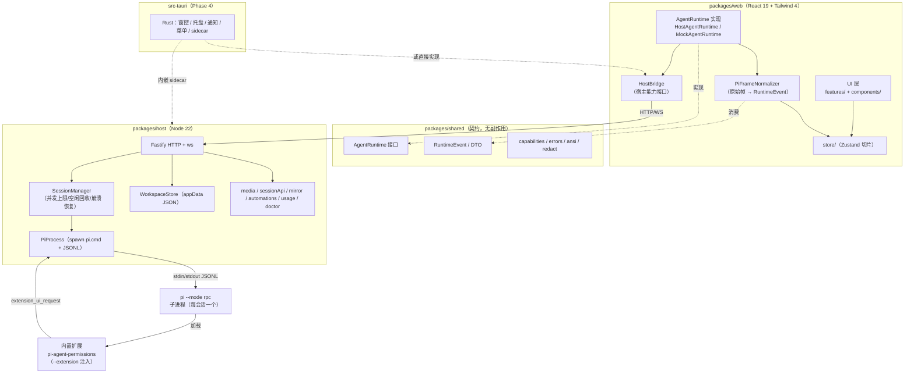
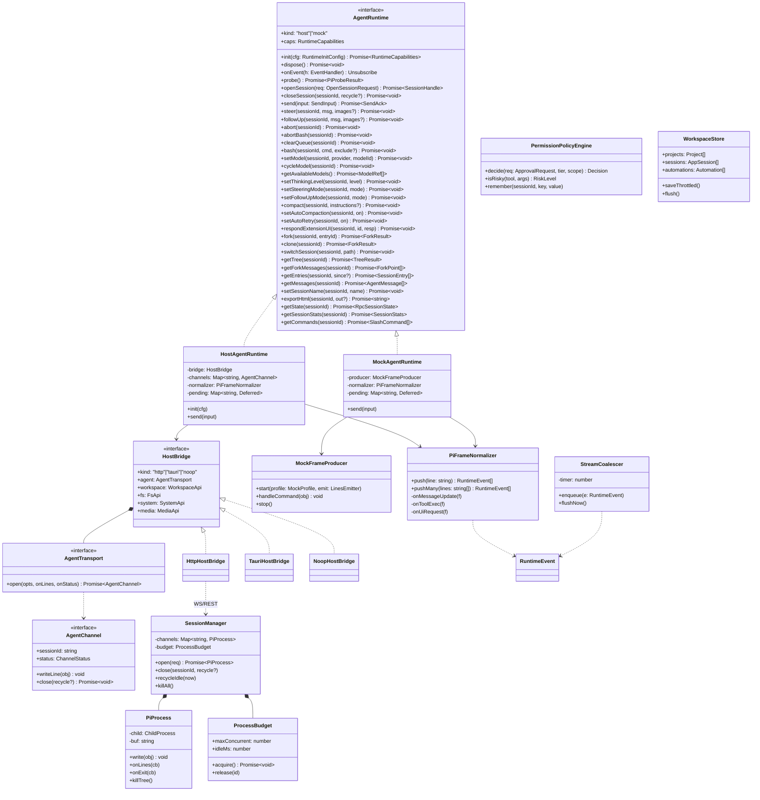
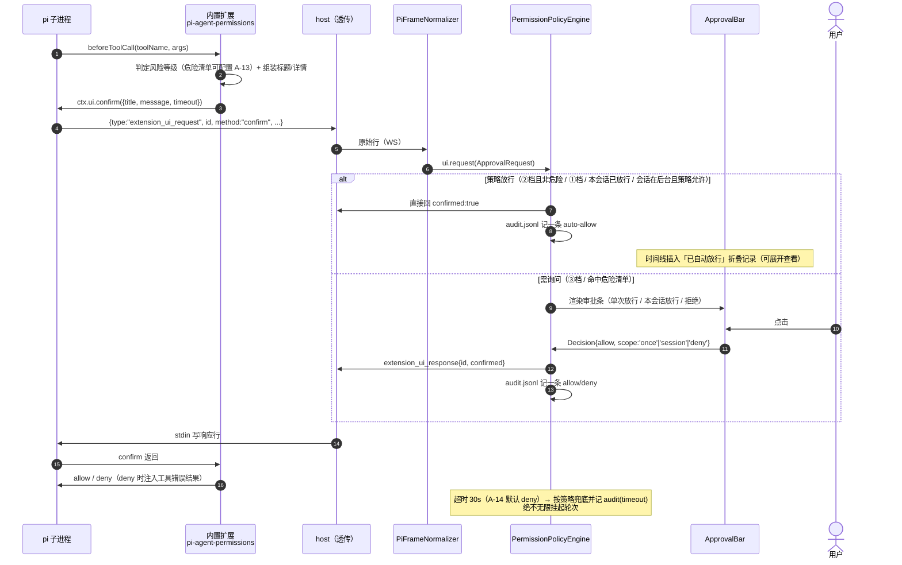
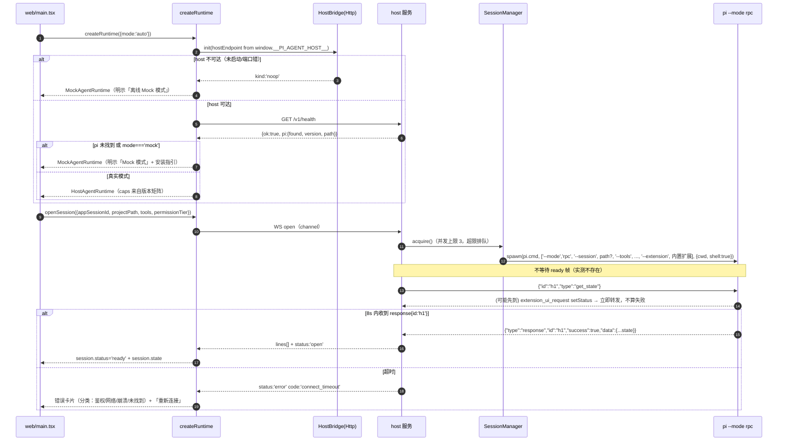
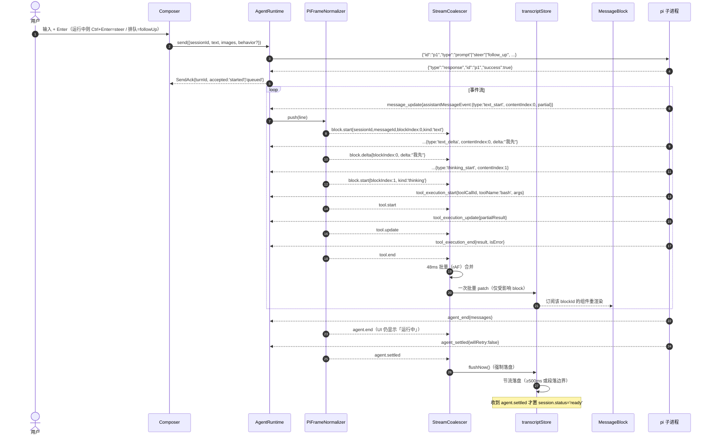
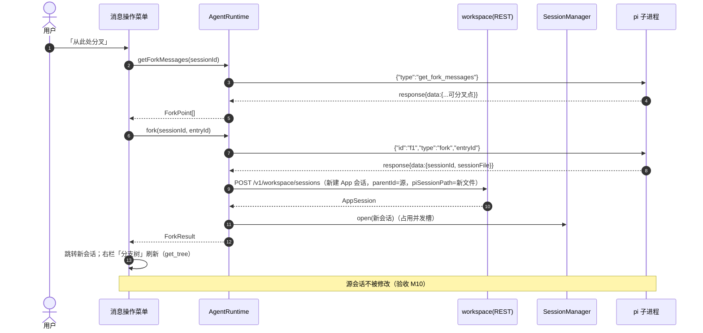
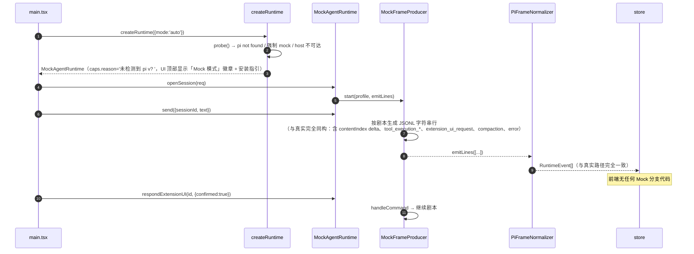
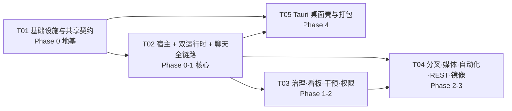

# pi-agent 系统架构设计与任务分解

| 项 | 内容 |
|---|---|
| 文档语言 | 简体中文 |
| 项目 | `pi-agent`（`pi` coding agent 的图形化工作台） |
| 版本 | v1.0 · 2026-09-09 |
| 作者 | 高见远（架构师） |
| 上游输入 | `docs/PRD.md`（v1.0 164 需求 / 21 模块；v1.1 扩至 171 条，见 §11）、`docs/PI-RPC-PROTOCOL.md`（实测 pi 0.85.0）、`reference-grok-app/` |
| 交付范围 | Web 全量（Phase 0–3）+ Tauri 2 可运行桌面壳（Phase 4） |
| 关联文件 | `docs/class-diagram.mermaid`、`docs/sequence-diagram.mermaid` |

---

## 0. 摘要（TL;DR）

| 决策 | 结论 |
|---|---|
| **总体形态** | pnpm workspace 三包：`shared`（契约/归一化）+ `host`（Node 本地宿主服务）+ `web`（React 前端）+ `src-tauri`（Phase 4 桌面壳） |
| **Web 如何驱动本机 pi** | 浏览器不能 spawn → 起**本地 Node host 服务**（HTTP + WebSocket，绑 `127.0.0.1`，随机端口 49152–65535，令牌门禁）。host 负责 spawn `pi --mode rpc` 并**原样双向桥接 JSONL 行** |
| **归一化在哪一层** | **在前端 `shared` 层**（`PiFrameNormalizer`）。host 与未来的 Rust 宿主都只做「透传原始帧」，不做协议解析 → 协议演进只需改一处，Tauri 阶段 Rust 零协议逻辑 |
| **Mock 如何做到无感** | `MockFrameProducer` 产出**与真实同构的 JSONL 字符串**，经**同一个** `PiFrameNormalizer` → 前端无法区分 |
| **权限审批**（PRD A-01..A-14） | 前端策略引擎 + 内置 pi 扩展（`--extension` 注入，挂 `beforeToolCall` → `ctx.ui.confirm/select`）+ `--tools` 粗粒度兜底。四档：① YOLO / ② 重要修改时通知 / ③ 逐次询问（**全局默认**）/ ④ 只读。策略在**前端**判定 → ②③ 换档立即生效、①④ 重连生效；30s 超时默认拒绝；`audit.jsonl` 审计 |
| **握手** | **不依赖 `ready` 帧**（实测无）。spawn 后发 `get_state`，等 `response` 或首个 `extension_ui_request`，超时 8s 判定 `connectTimeout` |
| **终态** | 以 `agent_settled` 为一轮终态，`agent_end` 不是 |
| **Tauri 落地路径** | 接口按「Rust 可替换宿主」设计（`HostBridge`），但**首版 Tauri 建议以 Node host 作 sidecar 内嵌**（工作量现实），Rust 只做**窗控 / 托盘 / 通知 / 钥匙串（Z-10）/ 打包**。理由与权衡见 §1.6 |
| **样式栈偏离 PRD** | PRD 写 MUI，实际采用 **Tailwind CSS 4 + Radix UI + 自研组件**（与参考产品 grok-app 一致）。理由见 §1.2 |

---

## 1. 实现方案与框架选型

### 1.1 核心技术挑战

| # | 挑战 | 应对 |
|---|---|---|
| C1 | 浏览器无法 spawn 子进程 | 本地 Node host 服务（`127.0.0.1` + WS 双向桥接），Tauri 阶段替换为 Rust/sidecar，前端不变 |
| C2 | **无 `ready` 帧**，能力协商无锚点 | `get_state` 轮询式握手 + `pi --version` 版本矩阵；超时走 Mock 或错误分类 |
| C3 | 事件两层嵌套（`message_update` → `assistantMessageEvent`），delta + `contentIndex` | 归一化成 `message.delta{blockIndex, delta, kind}`，前端按 `(sessionId, messageId, blockIndex)` 累积；48ms 批量 flush，杜绝整段替换闪烁 |
| C4 | `agent_end` 非终态 | 归一化出 `agent.settled`，UI 只有它到达才收回「运行中」 |
| C5 | `statusText` 含 ANSI 转义 | `shared/util/ansi.ts` 剥离或转 `<span style=color>` |
| C6 | pi 无内置权限系统 | 内置扩展 + 前端策略引擎 + `--tools` 兜底（§4） |
| C7 | Windows：npm shim / 空格路径 / CRLF / 进程树 | `shell:true` + `pi.cmd`、`windowsHide:true`、PID 树杀、严格按 `\n` 分帧并 trim `\r` |
| C8 | 164 条需求 + 桌面壳，工作量现实性 | 5 批实现；P2 只搭骨架；每批可独立编译/运行/验证 |
| C9 | 流式高频 setState 导致卡顿 | 外部 store + 按 block 粒度订阅 + 48ms 合并 + 虚拟滚动 |
| C10 | 日志/凭据泄漏 | `logger.ts` 统一出口 + `redact.ts` 强制脱敏（正则覆盖 sk-、Bearer、api_key、token、aws、ghp_ 等） |

### 1.2 前端选型（含对 PRD 的偏离说明）

| 维度 | 选型 | 理由 / 权衡 |
|---|---|---|
| 构建 | **Vite 6** | 与 grok-app 一致；HMR 快；`frontendDist` 可直接喂 Tauri |
| 框架 | **React 19 + TypeScript 5.8** | 与参考产品一致；生态最全 |
| **样式** | **Tailwind CSS 4 + Radix UI 基座 + 自研组件** | ⚠️ **偏离 PRD 的 MUI**。理由：① 参考产品 grok-app 即 Tailwind + 自研，视觉对标最直接；② MUI 与 Tailwind 双套样式系统会打架（主题令牌分裂、SSR/暗色漏主题风险翻倍，直接违背 M04「无漏主题」验收）；③ MUI 包体大、定制成本高。PRD 的 MUI 只是未指定时的默认栈，此处显式覆盖。**代价**：需自建下拉/对话框/浮层等基础件 → 用 **Radix UI**（无样式、无障碍完备）补齐，成本可控 |
| 状态 | **Zustand 5**（切片式） | 轻量、可在 React 外读写（流式高频写入必需）、选择器订阅天然适配按 block 更新 |
| Markdown | **react-markdown 10 + remark-gfm + rehype-highlight + highlight.js** | 表格/代码/链接；与 grok-app 一致 |
| 虚拟滚动 | **@tanstack/react-virtual 3** | 侧栏 100+ 会话（P-09）、主聊天 ≥48 条（N-13） |
| 代码编辑器 | **CodeMirror 6**（lang-javascript/python/json/html/css + legacy-modes） | W-07 内置编辑器、W-06 Diff、批准前的只读预览 |
| 图标 | **@tabler/icons-react** | 与 grok-app 一致，图标密集体量小 |
| 媒体 | yet-another-react-lightbox / plyr / pdfjs-dist(+react-pdf) / docx-preview（P2） | D-01..D-05 |
| i18n | 自研极简（`i18n/zh-CN.ts` + `t()` + 类型约束） | V-06 首版中文，文案集中管理预留英文；不引 i18next 省成本 |
| 图表 | 自绘 SVG（热力图/用量） | 不引图表库，控包体 |
| 测试 | **Vitest 3 + @testing-library/react + jsdom** | 与 grok-app 一致 |

### 1.3 宿主（host）选型

| 维度 | 选型 | 理由 |
|---|---|---|
| 运行时 | **Node 22**（本机已装） | 与 pi 同运行时；spawn/JSONL 处理天然；后续可整包进 Tauri sidecar |
| HTTP | **Fastify 5**（+ `@fastify/static`、`@fastify/cors`） | 路由/静态/CORS 开箱；比手写 `http` 省一半代码 |
| WS | **ws 8** | 事实标准；与 Fastify 同轴 |
| 进程 | 原生 `child_process.spawn` + **tree-kill** | Windows 必须杀进程树 |
| 持久化 | **JSON 文件 + 节流落盘**（`appData`），用量用 `usage.jsonl` 按月分片 append | 避免 `better-sqlite3` 原生编译（Tauri 交叉编译地狱）；数据量级（千级会话）完全够 |
| 配置校验 | **zod** | host↔web 线协议 + 设置项校验，错误早暴露 |
| 日志 | 自研 `logger.ts`（pino 风格 JSONL） | 结构化 + redact 单一出口 |

### 1.4 架构分层图



### 1.5 关键设计：归一化放前端，host 只做透传

这是本架构最重要的一个反转。传统做法是在 host 里把 pi 的 NDJSON 解析成领域事件再推给前端；本设计**不这么做**：

```
pi stdout  ──(原始 JSONL 行)──▶  host PiProcess  ──(WS: {ch, lines: string[]})──▶  前端 PiFrameNormalizer  ──▶  RuntimeEvent  ──▶  store
Mock  producer ──(同构 JSONL 行)──────────────────────────────────────────────────────────▶（同一个 normalizer）
```

收益：
1. **Mock 天然同构**：Mock 只需产出字符串行，走完全相同的解析路径，不存在「Mock 少发一个字段导致前端分支」的隐患。
2. **Tauri 阶段 Rust 零协议逻辑**：Rust（或 sidecar）只负责 spawn + 管道 + WS 透传，协议演进（pi 升版本）只改 `shared` 一处。
3. **可录制回放**：把真实会话的原始行录成 `.jsonl` 文件，即可作为 fixture 驱动单测与 Mock（grok-app 的 golden test 思路）。
4. host 变薄，崩溃面小；协议 bug 在前端可断点调试。

代价：前端要解析所有帧（性能可忽略，实测量级 < 200 帧/秒）。

### 1.6 Tauri 阶段落地路径（诚实权衡）

| 方案 | 描述 | 工作量 | 结论 |
|---|---|---|---|
| **A. Node host 作 sidecar**（推荐首版） | Tauri 打包时把 `packages/host` 打成分发物，Rust 通过 `tauri-plugin-shell` sidecar 启停；Rust 只做窗口/托盘/通知/菜单/自绘窗控/**钥匙串**（Z-10） | 小（~1 批） | ✅ **采用**。前端零改动，协议零重写，符合 Z-01「复用同一份前端产物」验收 |
| B. Rust 重写宿主 | `src-tauri` 用 Rust 实现 spawn/JSONL/WS/REST/fs/媒体/自动化 | 巨大（约等于重写 host，且需处理 Windows 管道、ANSI、媒体 Range） | ⏸ 接口保留（`HostBridge` 抽象），未来可渐进替换，本轮不做 |

说明：`HostBridge` 接口已按 B 的边界设计（见 §3.3），因此 A→B 的迁移不会波及业务代码。包体代价：+Node 运行时约 40–60MB，startup 多一进程（约 300ms），可接受。

---

## 2. 文件列表

> 相对仓库根。★ = Phase 0 必须冻结的契约文件。

> ⚠️ **实现偏差备注（2026-09-10 文档-实现一致性核对）**：本节为设计期文件清单，最终实现存在目录/命名差异，实际以仓库为准：
> - **host**：设计中的 `workspace/*`（store/projects/sessions/automations/usage/audit/secrets/doctor）与 `extensions/install.ts` 实际落在 `src/server/`（`workspaceStore.ts`、`automations.ts`、`usage.ts`、`secrets.ts`、`doctor.ts`、`extensions.ts`、`routes.permissions.ts` 等）；无独立 `ProcessBudget.ts`（预算逻辑并入 `SessionManager`），亦无 `fs/pathScope.ts`（路径校验内联在 `fs/watcher.ts` 与各 route）。`log/redact.ts` 的脱敏实现落在 `@pi-agent/shared/src/util/redact.ts`，host 侧仅 `log/logger.ts` 做调用。
> - **web**：多个设计文件合并/改名（`KanbanView`、`SettingsView`（Doctor 并入其中，无 `sections/` 子目录）、`ToolCard`、`MirrorPanel`、`UsageHeatmap`、`AddProjectDialog`、`hostClient.ts`/`workspaceApi.ts`）；`SlashPanel`、`AtFilePanel`、`Attachments`、`StreamBanners`、`MessageBlock`、`HttpHostBridge`、`NoopHostBridge`、`framesink`、`transcriptStore`、`usageStore` 未单列（功能并入 `Composer`/`ChatView`/`ChatTimeline`/`chatStore`/`activityStore` 等）。

### 2.1 仓库根

| 路径 | 职责 |
|---|---|
| `package.json` | pnpm workspace 根；`dev` / `build` / `test` / `typecheck` / `lint` |
| `pnpm-workspace.yaml` | `packages/*` |
| `tsconfig.base.json` | 公共编译选项 + 路径别名 `@shared/*` `@/*` |
| `.npmrc` | `node-linker=hoisted`（Tauri/原生依赖友好）、`strict-peer-dependencies=false` |
| `.gitignore` / `.editorconfig` / `.prettierrc.json` / `eslint.config.js` | 工程规范 |
| `README.md` | 安装、启动、架构一图、非官方声明 |
| `scripts/dev.mjs` | 并发启动 host（写 `host.json`）与 vite（读 `host.json` 注入端点） |
| `scripts/build.mjs` | shared → web → host →（可选）tauri |
| `scripts/check-env.mjs` | Node/pi/Rust 环境体检（Doctor 的 CLI 版） |
| `scripts/make-sidecar.mjs` | Phase 4：把 host 打成 sidecar 可执行 |

### 2.2 `packages/shared`（`@pi-agent/shared`）

| 路径 | 职责 |
|---|---|
| `package.json` / `tsconfig.json` | `exports` 映射：`./runtime` `./protocol` `./util` |
| `src/index.ts` | 桶文件 |
| ★ `src/runtime/AgentRuntime.ts` | **AgentRuntime 接口 + 全部入参/返回类型**（§3.2） |
| ★ `src/runtime/events.ts` | `RuntimeEvent` 联合类型（前端唯一事件源） |
| ★ `src/runtime/normalizer.ts` | `PiFrameNormalizer`：原始帧 → `RuntimeEvent`（真/Mock 共用） |
| `src/runtime/commands.ts` | 35 种 pi 命令构造器 + 命令名常量 |
| `src/runtime/capabilities.ts` | 版本 → 能力矩阵（R-06） |
| `src/runtime/errors.ts` | `RuntimeErrorCode` 四类分类（CLI 未找到/鉴权/网络/崩溃）+ 中文文案 |
| `src/runtime/types.ts` | `RpcSessionState` / `SessionStats` / `SessionTreeNode` / `AgentMessage` / `SlashCommand` / `ModelRef` / `ThinkingLevel` |
| `src/runtime/frames.ts` | pi 原始帧的**宽松** TS 类型（`AnyPiFrame`），供 normalizer 判别 |
| ★ `src/protocol/permissions.ts` | 权限档位枚举、危险操作模式库、策略判定输入/输出（§4） |
| `src/protocol/hostWire.ts` | web↔host 线协议：WS 帧 `{ch,type,payload}`、REST DTO、错误码 |
| `src/protocol/workspace.ts` | `Project` / `AppSession` / `Automation` / `UsageBucket` / `Settings` 模型 |
| `src/protocol/hostBridge.ts` | `HostBridge` 宿主能力接口（Tauri 替换点） |
| `src/util/ansi.ts` | ANSI 剥离 / 转 HTML 片段 |
| `src/util/redact.ts` | 凭据脱敏正则库 |
| `src/util/id.ts` | `newId()`（crypto.randomUUID 封装） |
| `src/util/jsonl.ts` | **严格 `\n` 分帧器**（禁 readline，Web/Node 通用） |
| `src/util/format.ts` | 时长、token、费用、相对时间格式化 |

### 2.3 `packages/host`（`@pi-agent/host`，Node 22）

| 路径 | 职责 |
|---|---|
| `package.json` / `tsconfig.json` | `type: module`，bin: `pi-agent-host` |
| `src/index.ts` | 入口：解析参数 → 探测 pi → 起 HTTP/WS → 写 `host.json` → 注册退出清理 |
| `src/config/paths.ts` | appData / logs / sessions / extensions 目录解析（Win/mac/Linux） |
| `src/config/settings.ts` | 设置读写 + zod 校验 + 默认值 |
| `src/server/http.ts` | Fastify 实例、路由注册、CORS（仅本窗口 origin）、静态托管 `web/dist` |
| `src/server/ws.ts` | WS 通道：`session.open/close/write`、`ui.respond`、`doctor.run` 等 |
| `src/server/media.ts` | `GET /v1/media?t=&p=` 本地媒体投递（图片全量 ≤40MiB；视音/PDF Range 206 ≤2MiB） |
| `src/server/sessionApi.ts` | `GET /v1/health`、`GET /v1/sessions`、`POST /v1/sessions/{id}/turns` + 幂等键 |
| `src/server/mirror.ts` | 手机镜像静态页 + WS + 令牌/写 ACL 审计 |
| `src/server/routes.workspace.ts` | 项目/会话/自动化/用量/设置的 REST |
| `src/server/routes.fs.ts` | 文件读/写/列目录/`@` 搜索/外部打开/缩略图 |
| `src/server/routes.git.ts` | worktree list/create/delete/compare/push+PR |
| `src/pi/probe.ts` | 探测 PATH + 常见路径 + 手动路径；`pi --version`；能力矩阵 |
| `src/pi/args.ts` | spawn 参数构造（`--mode rpc` `--session` `--tools` `--extension` `--cwd`…） |
| `src/pi/spawn.ts` | Windows：`shell:true` + `pi.cmd`；env PATH 注入；`windowsHide` |
| `src/pi/process.ts` | `PiProcess`：stdin 写行（严格 `\n`）、stdout 分帧、stderr 捕获、退出与崩溃分类、PID 树杀 |
| `src/pi/jsonl.ts` | Node 侧分帧（复用 shared 实现） |
| `src/runtime/SessionManager.ts` | 会话↔进程映射、并发上限（默认 3）、空闲回收（30min）、后台续跑 |
| `src/runtime/PiBridge.ts` | 单会话通道：把 WS 写请求转发到进程 stdin，把 stdout 行批量推给 WS（16ms/64 行合并） |
| `src/runtime/ProcessBudget.ts` | 进程预算、排队、回收计时 |
| `src/runtime/crash.ts` | 崩溃分类与「重新连接」支持 |
| `src/workspace/store.ts` | appData JSON 存储 + 原子写 + ≥500ms 节流落盘 + 退出 flush |
| `src/workspace/projects.ts` | 项目 CRUD、信任状态、路径异常标记 |
| `src/workspace/sessions.ts` | 会话索引 CRUD、归档、迁移、CLI 会话导入（只读副本） |
| `src/workspace/automations.ts` | 自动化调度（进程内 `setTimeout` 巡检）+ ring 50 运行历史 |
| `src/workspace/usage.ts` | `usage.jsonl` append + 按日/时段聚合（热力图数据） |
| `src/workspace/audit.ts` | **审批审计日志**（A-10）：`audit.jsonl` + 导出；参数摘要过 redact |
| `src/workspace/secrets.ts` | **钥匙串集成（Z-10 / Q-03）**：Windows Credential Manager / macOS Keychain 优先 → 回退加密文件 0600；启动时迁移已有明文 |
| `src/workspace/doctor.ts` | 体检七项 → pass/warn/fail |
| `src/fs/pathScope.ts` | 路径白名单（受信任项目 + appData + `~/.pi`） |
| `src/fs/watcher.ts` | chokidar 文件监听（磁盘变更重载） |
| `src/log/logger.ts` | 结构化日志（JSONL 落盘 + WS 推送到 UI 的诊断面板） |
| `src/log/redact.ts` | redact 在 host 侧的实际应用（复用 shared 正则） |
| `src/extensions/install.ts` | 首次启动把内置扩展复制/链接到 appData（供 `--extension` 引用） |

### 2.4 `extensions/pi-agent-permissions`（内置 pi 扩展）

| 路径 | 职责 |
|---|---|
| `package.json` | 名称 `pi-agent-permissions` |
| `index.ts` | 挂 `beforeToolCall` → 按工具名/参数构造标题与风险等级 → `ctx.ui.confirm/select` 发 `extension_ui_request`；按返回值 allow/deny |
| `risk.ts` | 危险模式库（rm -rf / git push --force / sudo / 系统目录写 / 删除文件 / 网络外发 / .env 改写） |
| `README.md` | 安装与调试说明 |

> ⚠️ 实现前必须核对 pi 0.85.0 的扩展 API 真实签名（`beforeToolCall` 是否存在、`ctx.ui.confirm` 返回结构）。若 API 不匹配，退化为「`--tools` 白名单 + 前端提示不支持细粒度审批」（见 §9 待明确 Q-A）。

### 2.5 `packages/web`（`@pi-agent/web`）

| 路径 | 职责 |
|---|---|
| `index.html` | 挂载点 + 启动骨架 + CSP |
| `vite.config.ts` | React 插件、`@` 别名、`/host` 代理、`host-info` 注入插件、manualChunks |
| `src/main.tsx` | 入口：bootstrap host 端点 → 创建 runtime → 挂载 |
| `src/App.tsx` | 路由壳（`#/session/:id`、`#/kanban`、`#/settings/:section`…） |
| `src/styles/tokens.css` | 设计令牌（亮/暗）：色板、圆角、阴影、字号、状态色 |
| `src/styles/global.css` | Tailwind 4 `@theme` 桥接 + 滚动条/代码块/对话框无漏主题修正 |
| ★ `src/runtime/createRuntime.ts` | 探测与降级（auto/real/mock），组装 runtime |
| ★ `src/runtime/HostAgentRuntime.ts` | 经 `HostBridge` 开通道 → 原始行 → normalizer → `RuntimeEvent` |
| ★ `src/runtime/MockAgentRuntime.ts` | 同接口，帧源为 `MockFrameProducer` |
| `src/runtime/MockFrameProducer.ts` | 剧本化产出 JSONL 行（含工具调用、审批、压缩、错误注入、可配延迟） |
| `src/runtime/StreamCoalescer.ts` | 48ms 批量 flush + 按 blockIndex 累积 |
| `src/runtime/framesink.ts` | 把 normalizer 输出接到 store 的适配层 |
| `src/host/HostBridge.ts` | 接口聚合：`agent` / `workspace` / `fs` / `system` / `media` |
| `src/host/HttpHostBridge.ts` | HTTP/WS 实现（浏览器） |
| `src/host/TauriHostBridge.ts` | Phase 4：invoke 实现（同接口） |
| `src/host/NoopHostBridge.ts` | host 不可用时的降级（只读演示） |
| `src/store/index.ts` | Zustand root（切片合并） |
| `src/store/sessionStore.ts` | 会话列表、当前会话、状态机 |
| `src/store/transcriptStore.ts` | 消息块（blocks）Map、流式写入、虚拟化索引 |
| `src/store/uiStore.ts` | 布局比例、侧栏/右栏折叠、主题、模态栈 |
| `src/store/projectStore.ts` | 项目与信任 |
| `src/store/permissionStore.ts` | 权限档位（全局/项目/会话） |
| `src/store/settingsStore.ts` | 设置与 Doctor 结果 |
| `src/store/usageStore.ts` | 用量与热力图 |
| `src/features/shell/AppShell.tsx` | 三栏布局 + 可拖拽分隔 + 记忆 |
| `src/features/shell/TitleBar.tsx` | 顶部栏：项目/分支/模型/思考/权限 chip（桌面阶段含自绘窗控插槽） |
| `src/features/shell/Sidebar.tsx` | 搜索 + 项目树（虚拟化）+ 看板/已安排/归档入口 + pi 状态 |
| `src/features/shell/RightAside.tsx` | 变更 / 任务 / 分支树 三 Tab + 上下文占用条 |
| `src/features/chat/ChatTimeline.tsx` | 虚拟滚动时间线 + 贴底 |
| `src/features/chat/MessageBlock.tsx` | 单块订阅渲染（text / thinking / toolCall） |
| `src/features/chat/ToolCallCard.tsx` | 工具卡片：参数/状态/耗时/流式输出 |
| `src/features/chat/ApprovalBar.tsx` | 审批条（单次放行/本会话放行/拒绝） |
| `src/features/chat/ExtensionUIRenderer.tsx` | select / input / editor / notify / setStatus / setWidget |
| `src/features/chat/Composer.tsx` | 输入区：上下文条、编辑器、工具行、运行中插话/排队/停止 |
| `src/features/chat/SlashPanel.tsx` | `/` 命令面板（来自 `get_commands`） |
| `src/features/chat/AtFilePanel.tsx` | `@` 文件搜索引用 |
| `src/features/chat/Attachments.tsx` | 图片/文件拖拽分流 |
| `src/features/chat/StreamBanners.tsx` | 压缩 / 重试 / stall / 结束轮次 chip |
| `src/features/kanban/KanbanPage.tsx` | 四列看板 + 卡片操作 |
| `src/features/projects/ProjectPicker.tsx` / `TrustDialog.tsx` | 项目选择与信任确认 |
| `src/features/diff/ChangesPanel.tsx` | 会话级变更：接受/拒绝/还原 |
| `src/features/editor/CodeEditor.tsx` | CodeMirror 6 多标签编辑 |
| `src/features/branch/BranchTree.tsx` | `get_tree` 可视化 + 导航/分叉 |
| `src/features/media/MediaViewer.tsx` | 图片/视频/音频/PDF/Office 预览 |
| `src/features/automations/AutomationsPage.tsx` | 表单 + 自然语言创建 + 列表 + 历史 |
| `src/features/settings/SettingsPage.tsx` + `sections/*.tsx` | 六分区设置 |
| `src/features/settings/sections/PermissionsSection.tsx` | 权限四档 + 三级作用域 + 危险清单可配置（A-13）+ 超时策略（A-14）+ 审计导出（A-10） |
| `src/features/settings/DoctorModal.tsx` | 体检弹窗 |
| `src/features/mirror/MirrorPage.tsx` | 手机镜像（单栏 + 底部抽屉） |
| `src/features/worktree/WorktreeChip.tsx` | worktree 选择/创建 |
| `src/features/usage/UsagePanel.tsx` + `Heatmap.tsx` | 用量与热力图 |
| `src/lib/permissionEngine.ts` | ★ 权限策略引擎（§4） |
| `src/lib/processPolicy.ts` | 并发/回收/stall 的前端呈现策略 |
| `src/lib/markdown.tsx` | Markdown 渲染组件（代码复制、表格横滚） |
| `src/lib/mediaUrl.ts` | 本地路径 → host 媒体 URL |
| `src/lib/keybindings.ts` | 快捷键体系 + 面板 |
| `src/lib/commandPalette.ts` | Cmd/Ctrl+K 命令面板 |
| `src/lib/persistLocal.ts` | 无 host 时的 localStorage 兜底 |
| `src/components/ui/*` | Radix 封装：Button/Dialog/Dropdown/Tooltip/Tabs/Switch/ScrollArea/Select/Toast/Popover/ContextMenu/Skeleton/EmptyState |
| `src/i18n/zh-CN.ts` + `index.ts` | 文案集中管理（`t()`） |
| `src/test/setup.ts` + `src/test/fixtures/*.jsonl` | 测试环境与真实帧 fixture |

### 2.6 `src-tauri`（Phase 4）

| 路径 | 职责 |
|---|---|
| `Cargo.toml` / `tauri.conf.json` / `tauri.windows.conf.json` | 壳配置；`frontendDist: ../packages/web/dist`；sidecar 声明 |
| `capabilities/default.json` | 最小权限（shell:allow-execute for sidecar、notification、os、process） |
| `src/main.rs` / `src/lib.rs` | 入口与命令注册 |
| `src/window.rs` | 无边框圆角 + 自绘窗控 + 拖拽 hit-test（Z-02） |
| `src/tray.rs` | 托盘 + 关窗到托盘（Z-03） |
| `src/notify.rs` | 桌面通知 + 点击深链直达会话（Z-04） |
| `src/keychain.rs` | 系统钥匙串读写（Z-10 / Q-03）：Windows Credential Manager、macOS Keychain |
| `src/sidecar.rs` | 启停 Node host sidecar、读 `host.json` 取端点、崩溃重启 |
| `src/cli.rs` | `--sessions` / `--session-send`（E-06，抢在 single-instance 前拦截） |
| `icons/` | 应用图标、托盘图标 |

---

## 3. 数据结构与核心接口

### 3.1 类图

> 完整源码：`docs/class-diagram.mermaid`



### 3.2 ★ `AgentRuntime` 接口（冻结契约）

```ts
// packages/shared/src/runtime/AgentRuntime.ts
import type { RuntimeEvent, Unsubscribe, EventHandler } from './events';
import type {
  RpcSessionState, SessionStats, SessionTreeNode, SessionEntry,
  AgentMessage, SlashCommand, ModelRef, ThinkingLevel,
} from './types';
import type { ExtensionUIResponse, ApprovalRequest } from '../protocol/permissions';
import type { HostEndpoint } from '../protocol/hostWire';

/* ---------- 基础枚举 ---------- */
export type RuntimeKind = 'host' | 'mock';
export type Thinking = ThinkingLevel; // 'off'|'minimal'|'low'|'medium'|'high'|'xhigh'|'max'
export type QueueMode = 'all' | 'one-at-a-time';
export type SessionStatus =
  | 'idle' | 'connecting' | 'ready' | 'running' | 'awaitingInput'
  | 'compacting' | 'retrying' | 'error' | 'closed';

/* ---------- 能力矩阵（R-06 降级依据） ---------- */
export interface RuntimeCapabilities {
  mode: 'real' | 'mock';
  piVersion?: string;
  piPath?: string;
  reason?: string;                       // 降级原因（UI 明示「Mock 模式」）
  supports: {
    fork: boolean; tree: boolean; stats: boolean; commands: boolean;
    thinkingLevel: boolean; modelSwitch: boolean; compaction: boolean;
    autoRetry: boolean; extensionUI: boolean; bash: boolean;
    exportHtml: boolean; images: boolean; queueModes: boolean;
  };
}

/* ---------- 初始化 ---------- */
export interface RuntimeInitConfig {
  mode: 'auto' | 'real' | 'mock';        // R-05 强制模式
  host?: HostEndpoint;                   // { httpUrl, wsUrl, token, pid }
  piPath?: string;                       // R-04 手动指定
  maxConcurrentAgents: number;           // N-02 默认 3
  idleRecycleMs: number;                 // N-03 默认 1_800_000
  connectTimeoutMs: number;              // 默认 8_000（无 ready 帧，靠 get_state）
  uiRequestTimeoutMs: number;            // A-06/A-14 审批超时兜底，默认 30_000
  approvalTimeoutPolicy: 'deny' | 'allow'; // A-14 默认 'deny'（保守）
  stallWarnMs: number;                   // N-09 默认 60_000
  mock?: MockProfile;                    // 延迟/错误注入/剧本
}
export interface MockProfile {
  latencyMs: number;                     // 每帧间隔
  script: 'tool-heavy' | 'plain' | 'approval' | 'compact' | 'error' | 'recorded';
  recordedLines?: string[];              // 回放真实会话录制的原始行
  errorInjection?: 'none' | 'tool-fail' | 'crash' | 'auth';
}

/* ---------- 会话 ---------- */
export interface OpenSessionRequest {
  appSessionId: string;                  // App 侧会话 ID（与 pi sessionId 双 ID，C-05）
  projectPath?: string;                  // 未绑定项目 → 默认工作区
  worktreePath?: string;
  piSessionPath?: string;                // 恢复：--session <path>
  piSessionId?: string;                  // 恢复：--session-id
  title?: string;
  model?: { provider: string; modelId: string };
  thinking?: Thinking;
  tools?: string[];                      // 只读档：['read','grep','find','ls']（W-05）
  permissionTier: PermissionTier;        // 影响 --tools / --approve
  extraArgs?: string[];
}
export interface SessionHandle {
  appSessionId: string;
  piSessionId?: string;
  sessionFile?: string;
  status: SessionStatus;
  caps: RuntimeCapabilities;
}

export interface SendInput {
  sessionId: string;
  text: string;
  images?: ImageAttachment[];            // { path?, mime, dataUrl? }
  behavior?: 'steer' | 'followUp';       // 运行时发送必须显式（协议约束 3）
}
export interface SendAck { turnId: string; accepted: 'started' | 'queued'; }

export interface ForkResult { appSessionId: string; piSessionId?: string; sessionFile?: string; }
export interface TreeResult { tree: SessionTreeNode[]; leafId?: string; }
export interface ForkPoint { entryId: string; label: string; preview?: string; }

export interface PiProbeResult {
  found: boolean; path?: string; version?: string;
  errorCode?: 'not_found' | 'auth' | 'network' | 'crash' | 'unknown';
  message: string;                        // 中文可读
}

/* ---------- 主接口 ---------- */
export interface AgentRuntime {
  readonly kind: RuntimeKind;
  readonly caps: RuntimeCapabilities;

  /* 生命周期 */
  init(cfg: RuntimeInitConfig): Promise<RuntimeCapabilities>;
  dispose(): Promise<void>;
  onEvent(h: EventHandler): Unsubscribe;              // (e: RuntimeEvent) => void
  probe(): Promise<PiProbeResult>;                    // R-04

  /* 会话生命周期 */
  openSession(req: OpenSessionRequest): Promise<SessionHandle>;
  closeSession(sessionId: string, opts?: { recycle?: boolean }): Promise<void>;
  switchSession(sessionId: string, sessionPath: string): Promise<void>;
  fork(sessionId: string, entryId: string): Promise<ForkResult>;
  cloneSession(sessionId: string): Promise<ForkResult>;
  setSessionName(sessionId: string, name: string): Promise<void>;
  exportHtml(sessionId: string, outputPath?: string): Promise<string>;

  /* 轮次控制 */
  send(input: SendInput): Promise<SendAck>;
  steer(sessionId: string, text: string, images?: ImageAttachment[]): Promise<void>;
  followUp(sessionId: string, text: string, images?: ImageAttachment[]): Promise<void>;
  abort(sessionId: string): Promise<void>;
  abortBash(sessionId: string): Promise<void>;
  clearQueue(sessionId: string): Promise<void>;
  bash(sessionId: string, command: string, excludeFromContext?: boolean): Promise<void>;

  /* 模型 / 思考 / 上下文 */
  setModel(sessionId: string, provider: string, modelId: string): Promise<void>;
  cycleModel(sessionId: string): Promise<void>;
  getAvailableModels(): Promise<ModelRef[]>;
  setThinkingLevel(sessionId: string, level: Thinking): Promise<void>;
  cycleThinkingLevel(sessionId: string): Promise<void>;
  setSteeringMode(sessionId: string, mode: QueueMode): Promise<void>;
  setFollowUpMode(sessionId: string, mode: QueueMode): Promise<void>;
  compact(sessionId: string, customInstructions?: string): Promise<void>;
  setAutoCompaction(sessionId: string, enabled: boolean): Promise<void>;
  setAutoRetry(sessionId: string, enabled: boolean): Promise<void>;
  abortRetry(sessionId: string): Promise<void>;

  /* 扩展 UI 应答（A-02/A-06，禁止 window.alert/confirm/prompt） */
  respondExtensionUI(sessionId: string, requestId: string, resp: ExtensionUIResponse): Promise<void>;

  /* 查询 */
  getState(sessionId: string): Promise<RpcSessionState>;
  getSessionStats(sessionId: string): Promise<SessionStats>;
  getCommands(sessionId: string): Promise<SlashCommand[]>;
  getMessages(sessionId: string): Promise<AgentMessage[]>;
  getEntries(sessionId: string, since?: number): Promise<SessionEntry[]>;
  getTree(sessionId: string): Promise<TreeResult>;
  getForkMessages(sessionId: string): Promise<ForkPoint[]>;
  getLastAssistantText(sessionId: string): Promise<string>;
}
```

### 3.3 `HostBridge`（宿主能力接口 · Tauri 替换点）

```ts
// packages/shared/src/protocol/hostBridge.ts
export interface HostBridge {
  readonly kind: 'http' | 'tauri' | 'noop';
  init(cfg: HostEndpointConfig): Promise<void>;
  readonly agent: AgentTransport;     // 会话通道（原始 JSONL 行）
  readonly workspace: WorkspaceApi;   // 项目/会话/自动化/用量/设置 CRUD
  readonly fs: FsApi;                 // 受白名单约束的文件访问
  readonly system: SystemApi;         // 通知/剪贴板/外部打开/钥匙串/窗口控制
  readonly media: MediaApi;           // 本地路径 → 可播放 URL
}

export interface AgentTransport {
  open(
    opts: OpenSessionRequest & { caps: RuntimeCapabilities },
    onLines: (lines: string[]) => void,
    onStatus: (s: ChannelStatus, err?: RuntimeError) => void,
  ): Promise<AgentChannel>;
}
export interface AgentChannel {
  readonly sessionId: string;
  readonly status: ChannelStatus;   // 'connecting'|'open'|'closed'|'error'
  writeLine(obj: unknown): void;    // 序列化为单行 JSON + '\n'
  close(recycle?: boolean): Promise<void>;
}
export type ChannelStatus = 'connecting' | 'open' | 'closed' | 'error';

export interface FsApi {
  readText(p: string, maxBytes?: number): Promise<string>;
  writeText(p: string, content: string): Promise<void>;
  listDir(p: string): Promise<DirEntry[]>;
  searchFiles(root: string, q: string, limit?: number): Promise<string[]>;
  exists(p: string): Promise<boolean>;
  stat(p: string): Promise<FileStat>;
  openExternal(p: string): Promise<void>;
  showInFolder(p: string): Promise<void>;
  watch(p: string, cb: (e: FsWatchEvent) => void): Promise<Unsubscribe>;
}
export interface SystemApi {
  notify(input: { title: string; body: string; deepLink?: string }): Promise<void>;
  setClipboardText(t: string): Promise<void>;
  getSecret(k: string): Promise<string | null>;
  setSecret(k: string, v: string): Promise<void>;
  windowControls?: WindowControls;      // Tauri 阶段提供：minimize/maximize/close/setTitle
  openLogsDir(): Promise<void>;
  openDataDir(): Promise<void>;
}
export interface MediaApi { url(absPath: string): string; thumbnail(absPath: string): Promise<string>; }
```

### 3.4 `RuntimeEvent`（前端唯一事件源）

```ts
// packages/shared/src/runtime/events.ts
export type RuntimeEvent =
  /* 会话与轮次 */
  | { t: 'session.status';   sessionId: string; status: SessionStatus; detail?: string }
  | { t: 'session.state';    sessionId: string; state: RpcSessionState }
  | { t: 'agent.start';      sessionId: string; turnId: string }
  | { t: 'agent.end';        sessionId: string; turnId: string }              // 非终态
  | { t: 'agent.settled';    sessionId: string; turnId: string; willRetry?: boolean }
  | { t: 'turn.start';       sessionId: string; turnId: string }
  | { t: 'turn.end';         sessionId: string; turnId: string; toolResults?: unknown[] }

  /* 流式内容（contentIndex 分块累积，禁止整段替换） */
  | { t: 'message.start'; sessionId: string; messageId: string; role: 'assistant' }
  | { t: 'block.start';   sessionId: string; messageId: string; blockIndex: number; kind: 'text'|'thinking'|'toolCall' }
  | { t: 'block.delta';   sessionId: string; messageId: string; blockIndex: number; kind: BlockKind; delta: string }
  | { t: 'block.end';     sessionId: string; messageId: string; blockIndex: number; kind: BlockKind }
  | { t: 'message.end';   sessionId: string; messageId: string }

  /* 工具 */
  | { t: 'tool.start';  sessionId: string; toolCallId: string; toolName: string; args: unknown }
  | { t: 'tool.update'; sessionId: string; toolCallId: string; partialResult: unknown }
  | { t: 'tool.end';    sessionId: string; toolCallId: string; result: unknown; isError: boolean; durationMs?: number }

  /* 扩展 UI（审批/选择/输入/即发即忘） */
  | { t: 'ui.request';   sessionId: string; req: ExtensionUIRequest }   // 需应答
  | { t: 'ui.status';    sessionId: string; statusKey: string; text: string; ansi?: boolean }
  | { t: 'ui.notify';    sessionId: string; message: string; level?: 'info'|'warning'|'error' }
  | { t: 'ui.widget';    sessionId: string; key: string; lines: string[]; placement?: 'aboveEditor'|'belowEditor' }
  | { t: 'ui.title';     sessionId: string; title: string }
  | { t: 'ui.setEditorText'; sessionId: string; text: string }

  /* 队列 / 压缩 / 重试 / 条目 */
  | { t: 'queue.update'; sessionId: string; steering: unknown[]; followUp: unknown[] }
  | { t: 'compaction.start'; sessionId: string; reason: 'manual'|'threshold'|'overflow' }
  | { t: 'compaction.end';   sessionId: string; aborted?: boolean; willRetry?: boolean; summary?: string }
  | { t: 'retry.start'; sessionId: string; attempt: number; maxAttempts: number; delayMs: number }
  | { t: 'retry.end';   sessionId: string; success: boolean }
  | { t: 'entry.appended'; sessionId: string; entry: SessionEntry }
  | { t: 'session.info'; sessionId: string; name?: string; sessionFile?: string }
  | { t: 'bash.output'; sessionId: string; id?: string; delta: string }

  /* 统计与诊断 */
  | { t: 'stats.updated'; sessionId: string; stats: SessionStats }
  | { t: 'error'; sessionId?: string; code: RuntimeErrorCode; message: string; recoverable: boolean }
  | { t: 'raw'; sessionId?: string; line: string };   // 诊断面板保留原始帧
```

### 3.5 归一化要点（`PiFrameNormalizer`）

| 原始帧 | 归一化输出 | 说明 |
|---|---|---|
| `{type:'response',id,command,success,data}` | 派发对应 `Deferred`；`get_state` 额外发 `session.state`；`get_session_stats` 发 `stats.updated` | 命令-响应按 `id` 配对 |
| `{type:'extension_ui_request',id,method,...}` | 按 method 分派：`select/confirm/input/editor` → `ui.request`（需应答）；`notify/setStatus/setWidget/setTitle/set_editor_text` → 对应即发即忘事件 | `setStatus.statusText` 先过 `ansi.ts`（A-12）；按 **statusKey 分组**，`statusText` 省略即视为**清除**该 key（实测 MCP 状态走 `statusKey:"mcp"`） |
| `message_update` + `assistantMessageEvent` | `block.start/delta/end`，键为 `contentIndex` | `text_*`/`thinking_*`/`toolcall_*` → `kind` |
| `tool_execution_start/update/end` | `tool.start/update/end` | 与 `toolcall_*` 内容块按 `toolCallId` 关联（卡片与正文块互链） |
| `agent_end` | `agent.end`（**不置终态**） | |
| `agent_settled` | `agent.settled` → UI 收回「运行中」 | |
| `queue_update` / `compaction_*` / `auto_retry_*` / `entry_appended` / `session_info_changed` / `bash_execution_update` | 同名事件 | |
| 无法识别 | `raw` + `error{code:'protocol_unknown'}` | 前向兼容，不崩 |

---

## 4. 权限与审批体系（A-\*，用户已拍板）

### 4.1 四档权限

> 档位编号与 PRD §7.9 完全一致（A-01…A-14）。

| 档位 | 编号 / 标识 | 行为 | 默认性 | 实现路径 | PRD |
|---|---|---|---|---|---|
| **完全访问 / YOLO** | ① `yolo` | 不询问，全部放行 | ❌ **不得作为全局默认**；开启需**二次确认**（明确风险文案）；会话结束回到项目默认档 | 策略引擎直接 auto-confirm + 顶部红条常驻警示 | A-01 |
| **重要修改时通知** | ② `notify-on-risky` | 常规编辑与命令**自动放行**（时间线插一条「已自动放行」折叠记录）；命中危险清单才弹审批 | 可设为项目级默认 | 前端 `PermissionPolicyEngine.isRisky()` 判定 | A-02 |
| **逐次询问** | ③ `ask` | 写文件 / 执行命令均弹审批条：**单次放行 / 本会话放行 / 拒绝** | ✅ **全局默认恒为此档** | 扩展发 `confirm` → 前端审批条 | A-03 |
| **只读档** | ④ `read-only` | 禁止一切写与执行 | 可选 | spawn `--tools read,grep,find,ls` + 扩展侧二次拦截（**需重连进程生效**） | A-04 |

**作用域与记忆（A-05，Q14 已采信）**：优先级 **会话 > 项目 > 全局**；**默认按项目级记忆**，全局默认恒为 ③ `ask`，会话级可覆盖。

**切换生效路径（A-05 + M-04，绝不静默）**：
- ① `yolo` / ④ `read-only` 影响 spawn 参数 → toast 明示「**下次新建会话或重连后生效**」。
- ② / ③ 立即生效（策略在前端，无需重启进程）。

**超时策略（A-06 / A-14，Q13 已采信）**：默认 **30s 超时即拒绝**（保守）；设置页可改超时值与「超时即拒绝 / 即放行」策略。**绝不无限挂起轮次**。

**审计（A-10）**：每次决策落 `audit.jsonl`（时间 / 会话 / 工具 / 参数摘要 / 档位 / 结果含超时兜底），可导出；**参数摘要过 `redact`，不存明文凭据**。

**危险清单可配置（A-13）**：默认清单内置 + 用户自定义正则/关键字，支持项目级覆盖；配置存 `settings.json`，扩展与前端各持一份判定（前端为准）。

### 4.2 拦截链路



**后台会话审批（A-09）**：`ApprovalRequest` 持久化在 `permissionStore`（按 `sessionId` 保留），切走后仍在；同时发 toast / 桌面通知（Tauri 阶段 Z-04 点击深链直达该会话）。切回时审批条重新挂载，可继续处理。

**关键设计**：策略判定放在**前端**。扩展无条件发请求，前端决定「是否真的打扰用户」。好处：① 换档无需重启 pi 进程；② 危险操作库可在 UI 侧热更新；③ 扩展代码极简（只做「请求 + 按结果放行/拒绝」）；④ 换后端（Mock/Tauri）策略逻辑零改动。

### 4.3 危险操作模式库（`extensions/pi-agent-permissions/risk.ts`，前端镜像一份，与 PRD §7.9.1 一致）

| 类别 | 判据（默认清单，A-13 可增删 + 项目级覆盖） |
|---|---|
| 删除 / 破坏性 | `rm -rf`、`rm` 带 `-r`/`-f`、`git clean -fd`、`del /s`、`Remove-Item -Recurse` |
| Git 破坏性 | `git push --force`/`-f`、`git reset --hard`、`git checkout .`、`git branch -D`、`git rebase` 改写已推送历史 |
| 权限提升 | `sudo`、`runas`、sudoers 修改、`chmod 777`、`chown` |
| 系统 / 项目外写入 | 写入项目目录之外、`/etc`、`C:\Windows`、`/usr`、`/System`、用户主目录点文件 |
| 网络副作用 | `curl \| sh`、`wget -O- \| bash`、`npm i -g`、`pip install` 到系统环境 |
| 凭据与密钥 | 读取/写入 `.env`、SSH 私钥、token 文件、云凭据 |
| 进程与服务 | `kill -9`、杀非本会话进程、启停系统服务 |
| 数据库 | `DROP` / `TRUNCATE` / `DELETE` 无 `WHERE`、迁移回滚 |

三级输出：`block`（任何档位都拒绝并记录）· `risky`（②档下弹审批，①档下自动放行但记 audit）· `normal`（②/① 档自动放行）。

---

## 5. 程序调用流程

> 完整源码：`docs/sequence-diagram.mermaid`

### 5.1 启动与握手（无 `ready` 帧 + Mock 降级）



### 5.2 发送消息 → 流式渲染完成



### 5.3 会话分叉



### 5.4 Mock 降级与同构保证



---

## 6. 任务分解（5 批 · 每批可独立编译/运行/验证）

> **依赖原则**：T01 是所有人地基；T02 打通全链路；T03/T04 在 T02 之上按模块扩展，二者内部步骤有序、彼此弱耦合；T05 只依赖 T01（前端产物）与 T02（sidecar）。

### T01 · 项目基础设施与共享契约（Phase 0 地基）

| 项 | 内容 |
|---|---|
| **目标** | 可 `pnpm dev` 启动：三栏空壳 + 亮/暗主题 + 路由；`shared` 契约与归一化器可用并有单测 |
| **优先级** | P0 |
| **依赖** | 无 |
| **主要文件** | 根 `package.json` `pnpm-workspace.yaml` `tsconfig.base.json` `.npmrc` `eslint.config.js` `.prettierrc.json` `.gitignore` `README.md`；`scripts/dev.mjs` `scripts/build.mjs` `scripts/check-env.mjs`；`packages/shared/**`（`AgentRuntime.ts` `events.ts` `normalizer.ts` `commands.ts` `capabilities.ts` `errors.ts` `types.ts` `frames.ts` `protocol/*` `util/*`）；`packages/host/src/{index.ts,config/*,server/http.ts,server/ws.ts,log/*}`（最小可启动版）；`packages/web/` 的 `index.html` `vite.config.ts` `src/main.tsx` `src/App.tsx` `src/styles/*` `src/host/*` `src/store/*` `src/features/shell/*` `src/components/ui/*` `src/i18n/*` `src/lib/keybindings.ts` |
| **覆盖需求** | R-01（接口）· R-06（能力矩阵数据结构）· R-08（日志与脱敏基础设施）· S-01 S-02 S-03 S-04 · V-07（遥测默认关）· Z-01（目录与复用结构预留）· V-06（文案集中）· 部分 R-04/R-05（配置位） |
| **出口验证** | ① `pnpm typecheck && pnpm lint && pnpm test` 全绿；② 浏览器打开三栏壳，亮/暗切换持久化；③ `shared` 的 normalizer 用 `src/test/fixtures/*.jsonl` 单测通过；④ host 启动并写出 `host.json`，`GET /v1/health` 返回 ok |

**实现步骤（有序）**
1. workspace 骨架 + TS/ESLint/Prettier/Tailwind 4 配置
2. `shared`：类型 → 命令构造器 → errors/capabilities → **normalizer + 单测**（先写测试，用实测帧）
3. `host`：paths/settings/logger/http/ws 最小可运行 + `host.json`
4. `web`：design tokens + 基础 UI 组件（Radix 封装）+ 三栏壳 + 主题 + 路由 + Zustand 切片骨架
5. `scripts/dev.mjs`（host + vite 并发，注入端点）

---

### T02 · 宿主服务 + 双运行时 + 聊天全链路打通（Phase 0–1 核心）

| 项 | 内容 |
|---|---|
| **目标** | **端到端可演示**：能开项目、建会话、发消息，真实 pi 与 Mock 都能完成一轮「含工具调用」的对话并正确渲染 |
| **优先级** | P0 |
| **依赖** | T01 |
| **主要文件** | `packages/host/src/pi/*`（probe/args/spawn/process/jsonl）· `packages/host/src/runtime/*`（SessionManager/PiBridge/ProcessBudget/crash）· `packages/host/src/server/routes.workspace.ts` `routes.fs.ts` `media.ts` · `packages/web/src/runtime/*`（createRuntime/HostAgentRuntime/MockAgentRuntime/MockFrameProducer/StreamCoalescer/framesink）· `packages/web/src/features/chat/*`（ChatTimeline/MessageBlock/ToolCallCard/Composer/SlashPanel/AtFilePanel/Attachments/StreamBanners）· `packages/web/src/features/projects/*` · `packages/web/src/lib/markdown.tsx` `mediaUrl.ts` |
| **覆盖需求** | R-02 R-03 R-04 R-05 R-07 · P-01..P-05 P-09 · C-01 C-02 C-03 · N-01 N-04 N-07 N-08 · T-01 T-02 T-04 T-05 T-06 T-08 T-09 T-10 · W-01 W-02 · X-01 · V-03 · D-01 D-02 · Q-01 |
| **出口验证** | 验收剧本 **M01 / M02 / M03 / M05 / M11 / M13**：真实一轮含工具对话；双会话不串；删 pi 后进 Mock；四类错误文案互不混淆；5 分钟流式无写盘尖刺与内存失控；**无 `ready` 帧下 `get_state` 握手可正确判定就绪与能力** |

**实现步骤（有序）**
1. host：`pi/probe`（PATH + 常见路径 + 手动）→ `pi/args` → `pi/spawn`（Windows shim/env/CRLF）→ `pi/process`（严格 `\n` 分帧 + 树杀）
2. host：`SessionManager` + `PiBridge` + `ProcessBudget` + `crash`
3. web：`HostAgentRuntime`（WS 通道 + normalizer + 命令 Deferred 配对）→ `MockAgentRuntime` + `MockFrameProducer` → `createRuntime` 探测降级
4. web：`StreamCoalescer`（48ms + blockIndex 累积）→ `transcriptStore` → `ChatTimeline`（虚拟滚动 + 贴底）
5. web：`MessageBlock`（text/thinking/toolCall）+ `ToolCallCard` + Markdown
6. web：`Composer`（Enter/Ctrl+Enter/@/`/拖拽）+ `SlashPanel`
7. host：`routes.workspace`（项目/会话 CRUD + 信任）+ `routes.fs` + `media`
8. 端到端联调 + 录制真实帧为 fixture

---

### T03 · 进程治理、看板、干预与权限审批（Phase 1–2 治理）

| 项 | 内容 |
|---|---|
| **目标** | 日用就绪：并行可信、后台续跑、看板总览、插话/排队/停止、工具审批四档、模型与思考切换、压缩与用量、设置与 Doctor |
| **优先级** | P0 + 部分 P1 |
| **依赖** | T02 |
| **主要文件** | `packages/host/src/runtime/*`（增强：空闲回收/stall/心跳）· `packages/host/src/workspace/{automations.ts,usage.ts,secrets.ts,doctor.ts}` · `packages/host/src/server/routes.git.ts` · `extensions/pi-agent-permissions/*` · `packages/web/src/lib/permissionEngine.ts` `processPolicy.ts` · `features/chat/ApprovalBar.tsx` `ExtensionUIRenderer.tsx` · `features/kanban/*` · `features/settings/*` `DoctorModal.tsx` · `features/usage/*` · `store/permissionStore.ts` |
| **覆盖需求** | N-02 N-03 N-05 N-06 N-09 N-10 N-11 N-12 N-13 · K-01 K-02 · **A-01 A-02 A-03 A-04 A-05 A-06 A-07 A-08 A-09 A-10 A-11 A-13 A-14**（A-12 的 setStatus/notify 部分）· M-01 M-02 M-03 M-04 M-05 M-06 M-07 · S-06 S-07 · C-04 C-05 C-07 · T-03 T-11 T-13 T-14 · W-03 W-04 W-05 W-09 · V-01 V-02 V-03 V-04 · Q-02 Q-04 · R-09 |
| **出口验证** | 验收剧本 **M06 / M07 / M08 / M08b / M08c / M09 / M12 / M14**：3 会话并行后台续跑且看板状态正确；插话/排队/停止语义正确；③ 档默认弹审批且三选项生效、① 档需二次确认、② 档常规编辑无打扰但危险操作必弹、④ 档零落盘；压缩横幅可见；ANSI 状态栏无乱码；日志与审计无明文密钥 |

**实现步骤（有序）**
1. 进程治理：并发上限提示 + 空闲回收 + 崩溃恢复 + stall 检测 + 工具心跳 + Ghost 自愈
2. 看板四列 + 卡片直操作
3. steer / follow_up / abort / abort_bash / 队列条
4. **权限（本批重点）**：内置扩展（`beforeToolCall` + 危险清单）→ 前端策略引擎 → 审批条（工具名/目标/风险/三按钮）→ 30s 超时兜底（默认拒绝）→ 四档 + 三级作用域 + toast 生效路径 → 后台审批保留 + 通知 → `audit.jsonl` 与导出 → 危险清单可配置 → **严禁 `window.alert/confirm/prompt`**
5. 模型/思考/压缩/用量 chip
6. 设置六分区 + Doctor + 日志/数据目录
7. 命令面板 + 快捷键 + 消息操作（复制/引用/删除后续）

---

### T04 · 分叉与分支树、媒体与编辑器、自动化、本地 REST 与移动镜像（Phase 2–3 扩展面）

| 项 | 内容 |
|---|---|
| **目标** | 多端与自动化贯通：分叉/分支树可用；媒体与内置编辑器可用；自动化可创建可触发；脚本可经 REST 追加一轮；手机可扫码只读查看 |
| **优先级** | P1 为主（P2 仅搭骨架） |
| **依赖** | T02（不强依赖 T03，可与其并行开发） |
| **主要文件** | `packages/web/src/features/{branch,diff,editor,media,automations,mirror,worktree}/*` · `packages/host/src/server/{sessionApi.ts,mirror.ts}` · `packages/host/src/workspace/{automations.ts,usage.ts}` · `packages/host/src/git/worktree.ts` · `packages/host/src/fs/watcher.ts` · `packages/web/src/lib/commandPalette.ts` |
| **覆盖需求** | F-01 F-02 F-03 F-05 · W-06 W-07 W-08 · D-03 D-04 D-07（D-05/D-06 **仅骨架**）· U-01 U-02 U-03 U-04 U-05 U-06 · E-01 E-02 E-03 E-04（E-05/E-06 随 T05）· B-01 B-02 B-03 B-06 · Q-05 · G-01 G-02 · X-02 X-03 X-04（X-05/X-06/X-07 **仅骨架**）· P-06 P-07 P-08 · C-06 · V-05 V-06 · M-09 M-10 · A-07 |
| **出口验证** | 验收剧本 **M10**（分叉上下文正确截断）+ 手机浏览器可只读查看 + `curl` 经 REST 对指定会话追加一轮返回 `turn_started`/`queued` + 自动化到期触发并留痕 |

**实现步骤（有序）**
1. 分叉：入口 → `get_fork_messages` → `fork` → 新会话；分支树 `get_tree` 渲染与导航
2. 变更面板（Diff 接受/拒绝/还原）+ CodeMirror 内置编辑器
3. 媒体：视频/音频/PDF（Office 仅留入口与占位）
4. 本地 REST（health/sessions/turns + 幂等键 C-05 骨架）+ 令牌文件
5. 手机镜像（二维码 + 令牌 + 写 ACL 默认关 + 审计 + 移动端布局）
6. 自动化（表单 + 自然语言 fence 剥离 + 调度 + ring 历史）
7. worktree（列表/绑定/创建；删除/对比/PR 仅骨架）+ 用量热力图 + 扩展/技能/模板面板

---

### T05 · Tauri 2 桌面壳与打包（Phase 4）

| 项 | 内容 |
|---|---|
| **目标** | 同一份前端产物可打包为 Windows（及 macOS）桌面应用：无边框自绘窗控、托盘、通知、安装包；**密钥迁移到系统钥匙串**；sidecar 内嵌 host |
| **优先级** | **Z-01 Z-02 Z-03 Z-04 Z-06 Z-10 全部 P0（本轮必做）**；Z-05/Z-07 = P1；Z-08 仅骨架；Z-09 不做 |
| **依赖** | T01（前端产物）+ T02（host 可作 sidecar）+ T03（钥匙串迁移依赖 secrets 与设置页） |
| **主要文件** | `src-tauri/**`（`Cargo.toml` `tauri.conf.json` `tauri.windows.conf.json` `capabilities/*` `src/{main.rs,lib.rs,window.rs,tray.rs,notify.rs,sidecar.rs,cli.rs,keychain.rs}` `icons/*`）· `scripts/make-sidecar.mjs` · `packages/host/src/workspace/secrets.ts`（**钥匙串后端**，Z-10）· `packages/web/src/host/TauriHostBridge.ts` · `packages/web/src/features/shell/TitleBar.tsx`（窗控插槽） |
| **覆盖需求** | **Z-01 Z-02 Z-03 Z-04 Z-06 Z-10** · Z-05 Z-07 · E-06（CLI 入口）· U-07（托盘常驻）· A-09（通知直达审批）· Q-03（密钥不落明文）· Z-08 仅骨架 · Z-09 不做 |
| **出口验证** | 验收剧本 **M15**：`pnpm tauri build` 产出 `.msi`；安装启动后与 Web 版功能一致（前端代码复用率 ≥90%）；自绘窗控无死区；关窗到托盘；审批通知点击直达会话；密钥已入系统钥匙串且磁盘无明文 |

**实现步骤（有序）**
1. `tauri.conf.json` 指向 `packages/web/dist` + 最小 capabilities
2. sidecar 打包 host + 启停 + 崩溃重启 + 端点注入
3. **钥匙串（Z-10）**：Rust `keychain.rs` 提供 `get_secret/set_secret`；host `secrets.ts` 优先调钥匙串，失败回退加密文件 0600；启动时迁移已有明文键
4. 无边框 + 自绘窗控（Windows hit-test 死区排查）+ 拖拽
5. 托盘 + 关窗到托盘 + 桌面通知深链（审批/完成）
6. `TauriHostBridge`（先仅替换 `system.windowControls` / `notify` / `secret`，其余仍走 HTTP sidecar）
7. 安装包配置（`.msi` + portable，macOS `.dmg` 双架构）与产物校验

---

### 6.1 批次依赖图



### 6.2 本轮明确不做 / 仅骨架

| 项 | 处置 |
|---|---|
| IM 桥接（I-01..I-06，6 条全 P2） | **本轮不做**，仅在 `host/` 预留 `remote-im/` 目录与接口位 |
| Office 预览（D-05）/ 分享长图（D-06） | 仅按钮占位 + 「暂不支持」诚实文案 |
| pi 包安装（X-06）、主题（X-05）、技能热刷新（X-07） | 仅骨架 |
| worktree 删除/对比/推送 PR（G-03..G-06） | 仅骨架 |
| SSH 远端（Z-08，P2） | 仅骨架 |
| 自动更新（Z-05，P1）/ 开机自启（Z-07，P1） | 配置位预留，本轮不保证可用 |
| 桌面宠物（Z-09） | **不做**（PRD 已移出范围） |
| Rust 重写宿主（方案 B） | 不做，接口保留（`HostBridge`） |
| ✅ 本轮必做（不裁剪） | Z-01 Z-02 Z-03 Z-04 Z-06 Z-10（钥匙串）、A-01…A-11 + A-13/A-14 |

---

## 7. 依赖包列表

> Node v22.22.2 / pnpm 11.22.0 已验证可用；版本取当前主流的保守上界。

> ⚠️ **实现偏差备注（2026-09-10 文档-实现一致性核对）**：最终依赖以各包 `package.json` 为准。显著差异：web 未引入 react-markdown / remark-gfm / rehype-highlight / highlight.js（Markdown 为自研轻量渲染 `features/chat/Markdown.tsx`，无语法高亮）；未引入 @tanstack/react-virtual 与 use-stick-to-bottom（P-09 / N-13 虚拟滚动未实现）；未引入 Radix switch/select/scroll-area/context-menu/collapsible 与 docx-preview / html-to-image / mermaid；新增 `@codemirror/merge`、`codemirror`。根未用 rimraf / concurrently / zx，新增 esbuild、tsx。

### 7.1 根（devDependencies）

```jsonc
"typescript": "~5.8.3",
"eslint": "^9.30.0",
"@eslint/js": "^9.30.0",
"typescript-eslint": "^8.65.0",
"eslint-plugin-react-hooks": "^7.1.1",
"prettier": "^3.4.2",
"@types/node": "^22.15.0",
"vitest": "^3.2.4",
"jsdom": "^30.0.1",
"rimraf": "^6.0.1",
"concurrently": "^9.1.2",
"zx": "^8.5.0"                 // scripts/*.mjs 用，可选
```

### 7.2 `packages/shared`

```jsonc
"zod": "^3.24.1"               // 线协议与设置校验（零依赖、可 tree-shake）
```

### 7.3 `packages/host`

```jsonc
"fastify": "^5.3.0",
"@fastify/cors": "^10.0.2",
"@fastify/static": "^8.0.4",
"@fastify/websocket": "^11.0.2",   // 若不选此项则用裸 "ws": "^8.18.0" 挂到 fastify server
"ws": "^8.18.0",
"tree-kill": "^1.2.2",
"chokidar": "^4.0.3",
"zod": "^3.24.1",
"dayjs": "^1.11.13",
"@pi-agent/shared": "workspace:*"
```

> 说明：媒体投递不需要额外库（Node 原生流 + Range）；二维码由**前端**生成（`qrcode` 在 web 包），host 只提供局域网地址。

### 7.4 `packages/web`

```jsonc
/* 运行时 */
"react": "^19.1.0",
"react-dom": "^19.1.0",
"zustand": "^5.0.3",
"clsx": "^2.1.1",
"tailwind-merge": "^3.6.0",
"@tanstack/react-virtual": "^3.13.0",
"@radix-ui/react-dialog": "^1.1.6",
"@radix-ui/react-dropdown-menu": "^2.1.6",
"@radix-ui/react-popover": "^1.1.6",
"@radix-ui/react-tooltip": "^1.2.0",
"@radix-ui/react-tabs": "^1.1.3",
"@radix-ui/react-switch": "^1.1.3",
"@radix-ui/react-select": "^2.1.6",
"@radix-ui/react-scroll-area": "^1.2.3",
"@radix-ui/react-context-menu": "^2.2.6",
"@radix-ui/react-toast": "^1.2.6",
"@radix-ui/react-collapsible": "^1.1.3",
"@radix-ui/react-slot": "^1.2.0",
"@tabler/icons-react": "^3.45.0",
"react-markdown": "^10.1.0",
"remark-gfm": "^4.0.1",
"rehype-highlight": "^7.0.2",
"highlight.js": "^11.11.1",
"use-stick-to-bottom": "^1.1.6",
"yet-another-react-lightbox": "^3.32.1",
"plyr": "^3.8.4",
"pdfjs-dist": "^5.4.296",
"react-pdf": "^10.4.1",
"qrcode": "^1.5.4",
"@pi-agent/shared": "workspace:*",

/* CodeMirror 6（内置编辑器 + Diff） */
"@codemirror/state": "^6.7.1",
"@codemirror/view": "^6.43.9",
"@codemirror/commands": "^6.11.0",
"@codemirror/language": "^6.12.4",
"@codemirror/search": "^6.7.1",
"@codemirror/lang-javascript": "^6.2.5",
"@codemirror/lang-json": "^6.0.2",
"@codemirror/lang-python": "^6.2.1",
"@codemirror/lang-html": "^6.4.12",
"@codemirror/lang-css": "^6.3.1",
"@codemirror/legacy-modes": "^6.5.3",
"@lezer/highlight": "^1.2.3",

/* 可选（P2，按需引入） */
"docx-preview": "^0.4.0",
"html-to-image": "^1.11.13",
"mermaid": "^11.4.1",

/* 开发 */
"vite": "^6.3.5",
"@vitejs/plugin-react": "^4.5.2",
"tailwindcss": "^4.3.3",
"@tailwindcss/vite": "^4.3.3",
"@types/react": "^19.1.8",
"@types/react-dom": "^19.1.6",
"@types/qrcode": "^1.5.6",
"@testing-library/react": "^16.3.2",
"@testing-library/dom": "^10.4.1",
"@testing-library/jest-dom": "^7.0.1",
"@testing-library/user-event": "^14.6.5"
```

### 7.5 `src-tauri`（Phase 4）

```jsonc
// npm
"@tauri-apps/cli": "^2",
"@tauri-apps/api": "^2",
"@tauri-apps/plugin-shell": "^2",
"@tauri-apps/plugin-notification": "^2",
"@tauri-apps/plugin-process": "^2",
"@tauri-apps/plugin-os": "^2",
"@tauri-apps/plugin-dialog": "^2"

// Cargo
tauri = { version = "2", features = ["devtools"] }
tauri-build = { version = "2", features = [] }
tauri-plugin-shell = "2"
tauri-plugin-notification = "2"
tauri-plugin-process = "2"
tauri-plugin-os = "2"
tauri-plugin-dialog = "2"
keyring = { version = "3", features = ["windows-native", "apple-native"] }  # Z-10 钥匙串
serde = { version = "1", features = ["derive"] }
serde_json = "1"
```

---

## 8. 共享知识（跨文件约定 · 工程师必读）

### 8.1 目录别名与导入

| 别名 | 指向 | 适用 |
|---|---|---|
| `@shared/*` | `packages/shared/src/*` | 三包通用（web/host 都配） |
| `@/*` | `packages/web/src/*` | 仅 web |
| `~/` | `packages/host/src/*` | 仅 host |

- **禁止** web 直接 import host 源码；**禁止** host 反向 import web（除 `dist` 静态托管）。
- 类型一律从 `@shared/*` 取，不允许在 web/host 重复定义协议类型。

### 8.2 命名规范

| 对象 | 规范 | 示例 |
|---|---|---|
| 文件（组件） | PascalCase `.tsx` | `ToolCallCard.tsx` |
| 文件（逻辑/lib） | camelCase `.ts` | `permissionEngine.ts` |
| 测试 | `<name>.test.ts(x)` 同目录 | `normalizer.test.ts` |
| 类型/接口 | PascalCase，不加 `I` 前缀 | `AgentRuntime` |
| 常量 | UPPER_SNAKE | `DEFAULT_MAX_AGENTS` |
| Zustand store | `<domain>Store.ts`，导出 `use<Domain>Store` | `useSessionStore` |
| 事件 `t` 字段 | 点分小写 | `block.delta`、`agent.settled` |
| pi 命令 | 与协议一致 snake_case | `set_thinking_level` |
| CSS 变量 | `--pa-*` 前缀 | `--pa-bg`, `--pa-accent` |

### 8.3 状态管理分层（严格三层）

```
① 传输层  AgentRuntime（原始帧/事件）        无 React
② 领域层  StreamCoalescer → Zustand store    无 DOM
③ 视图层  features/* 组件（只订阅需要的切片）  纯展示 + 用户意图
```

- **禁止**组件直接调用 `runtime.send()`（必须经 `store` 的 action，便于统一审计/节流/错误）。
- **禁止**在渲染中做 delta 累积；累积只在 `StreamCoalescer`。
- 组件订阅粒度：消息块组件只订阅 `blocks[blockId]`，不得订阅整个 `transcript`。

### 8.4 事件总线与 ID 关联

- pi 命令 `id` 用 `crypto.randomUUID()`；`Deferred` 表 `_pending: Map<id, {resolve,reject,timer}>`，超时 15s 自动 reject（错误码 `timeout`）。
- 通道状态 `ChannelStatus` 与会话状态 `SessionStatus` 分离：通道断 ≠ 会话结束（可回收后重连）。
- 前端事件订阅统一 `runtime.onEvent()` 单点入口，`framesink.ts` 负责分发到各 store。**不要**在组件里 `onEvent`。

### 8.5 错误处理约定

| 层 | 约定 |
|---|---|
| host | 所有进程/IO 异常 → `RuntimeError{code,message,recoverable}`，**不得**把原始 stack 直接丢给前端（可写日志） |
| 前端 | 统一 `toUserMessage(code)` 中文文案；四类必须互不混淆：`cli_not_found` / `auth_failed` / `network` / `agent_crash` |
| UI | 失败**行内红点 + 短提示**（W-03），不做底部大块报错；可展开「详情」看诊断与原始帧 |
| 边界 | 每个 feature 至少一层 `ErrorBoundary`；审批/流式等关键路径不得因渲染异常丢失状态 |

### 8.6 类型放置位置

| 类型 | 位置 |
|---|---|
| pi 协议（帧/状态/统计） | `@shared/runtime/types.ts` + `frames.ts` |
| RuntimeEvent | `@shared/runtime/events.ts` |
| 工作区（项目/会话/自动化/用量） | `@shared/protocol/workspace.ts` |
| 权限 | `@shared/protocol/permissions.ts` |
| web↔host 线协议 DTO | `@shared/protocol/hostWire.ts` |
| 组件 Props | 就近定义并 `export`（同文件） |
| 环境/types | `packages/web/src/vite-env.d.ts`（`__PI_AGENT_HOST__` 声明） |

### 8.7 日志与脱敏（R-08 / Q-03，硬性）

- **唯一出口**：host 用 `logger.ts`，web 用 `console` 包装器（dev 可见，prod 落WS→host）。
- `redact.ts` 正则覆盖：`sk-*`、`sk-ant-*`、`Bearer <x>`、`api[_-]?key`、`token`、`secret`、`password`、`ghp_`/`gho_`/`ghs_`、`xoxb-`、`AKIA*`、`-----BEGIN * PRIVATE KEY-----`、URL query 中的 `key|token|access_token`。
- **写日志前必须过 redact**；代码评审检查项：新增 `console.log` / `logger.*` 必须确认无原始帧直写（原始帧只允许写入 `raw-<date>.jsonl` 且**仅在开启诊断模式时**）。
- 令牌文件 `host.json` 权限 `0600`；设置页**永不展示 token**，只给「打开令牌文件位置」。
- 遥测**默认关闭**（V-07）；任何外发必须 opt-in 且可审计。

### 8.8 Windows 专项（R-07）

- spawn：`spawn('pi.cmd', args, { cwd, shell: true, windowsHide: true, env: {...process.env, PATH: injectedPath} })`；`pi.cmd` 路径由 `probe()` 解析得到。
- 写 stdin：`JSON.stringify(obj) + '\n'`（**不要 `\r\n`**）。
- 读 stdout：仅按 `\n` 切分，`line.replace(/\r$/, '')`；**禁用 `readline`**（会在 U+2028/U+2029 误切）。
- 路径：一律 `path.resolve`；含空格路径全程加引号仅在 shell 拼接时；优先用 argv 数组避免转义问题（git 命令必须 argv，禁 shell）。
- 杀进程：`tree-kill`（Windows 用 `taskkill /pid X /T /F`）。

### 8.9 流式渲染红线

1. 累积键 = `(sessionId, messageId, blockIndex)`；**禁止**用整条 `message` 替换。
2. flush 周期 48ms（rAF 驱动），最多每帧处理 200 个事件防卡死。
3. 落盘节流 ≥500ms 或段落边界；`agent.settled` / `abort` / 页面隐藏 → 强制 flush。
4. 长列表必须虚拟滚动（`≥48` 条消息 / `≥100` 条会话）。
5. stall 检测：60s 无事件显示「仍在运行/可能卡住」+ 提供「结束本轮」；**绝不自动结束用户任务**。

### 8.10 端口与端点

- host 绑 `127.0.0.1`，端口在 **49152–65535** 随机（避免 `127.0.0.1:0` 落到 Chromium 禁用的 service port 导致 `ERR_UNSAFE_PORT`）。
- `{appData}/pi-agent/host.json`（0600）：`{ httpUrl, wsUrl, token, pid, version, startedAt }`。
- 前端通过构建时注入的 `window.__PI_AGENT_HOST__` 获取；dev 由 `vite.config.ts` 插件读取 `host.json` 注入。
- 媒体：`GET /v1/media?t=<token>&p=<urlencode(absPath)>`；CORS 仅允许本窗口 origin，**不得** `*`；CSP 允许 `http://127.0.0.1:*` 的 `img-src/media-src/connect-src`。

---

## 9. 待明确事项（Anything UNCLEAR）

| # | 问题 | 影响 | 当前假设 / 兜底 |
|---|---|---|---|
| **Q-A** | pi 0.85.0 扩展 API 的真实签名：`beforeToolCall` 钩子名、`ctx.ui.confirm/select` 参数与返回、扩展如何随 `--extension` 注入 | A-01/A-02/A-06 全部 | 假设为 `beforeToolCall` + `ctx.ui.confirm({title,message,timeout})`。**T03 开工前必须先读 `~/.pi/agent/node_modules/@earendil-works/pi-coding-agent` 的 extension d.ts 核实**；若钩子不存在 → 降级为「`--tools` 只读档 + 白名单 + UI 明示不支持细粒度审批」，A-01 降级为 P1 |
| **Q-B** | `get_state` 是否会稳定回 `response`？若 pi 未登录 / 启动慢，可能长时间无回 | 握手可靠性 | 假设会。兜底：8s 超时；期间到达的 `extension_ui_request` 视为「进程活着」并延长等待至 15s；仍无 → `connect_timeout` + 分类错误 + 「重新连接」 |
| **Q-C** | `fork` 的 `entryId` 与 `get_fork_messages` 返回结构；`get_tree` 节点字段 | F-01/F-02/F-03 | 按协议文档实现，T04 首日实测校正；normalizer 对未知结构发 `raw` 不崩 |
| **Q-D** | 会话数据是否与 CLI 共享 `~/.pi/agent/sessions` | C-03/P-07 与并发安全 | 采用 PRD Q4 建议：**默认独立目录**（`{appData}/pi-agent/sessions` 或 `--session-dir` 指向），CLI 会话仅**只读导入**；共享模式不做 |
| **Q-E** | Tauri 是否接受「Node sidecar」包体（+40–60MB）与多一进程 | Z-01/Z-06 | 首版采用 sidecar；若不可接受，按 `HostBridge` 接口渐进用 Rust 替换（优先级：fs → media → spawn） |
| **Q-F** | 用量/费用单价从哪来 | Q-04/Q-05/Q-07 | 仅本地累计 `get_session_stats`（tokens/cost）；无法获得单价时诚显示「不可用」，**不虚构** |
| **Q-G** | 前端样式栈偏离 PRD 的 MUI | 全局 | 已按 Tailwind 4 + Radix 设计（§1.2）。若产品坚持 MUI，T01 需重做基础组件层（约 +1 批工作量），请尽早拍板 |
| **Q-H** | 是否需要纯静态部署（无 host 也能打开） | 部署形态 | 本设计**不支持**：工作区数据存 host。若无 host，前端显示「本地宿主未运行」+ 启动指引（内存只读演示） |
| **Q-I** | 中英双语是否本轮落地 | V-06 | 本轮仅中文，但所有文案走 `i18n/zh-CN.ts` + `t()`，为英文预留 |
| **Q-J** | pi 版本能力矩阵的下界（最低支持到哪个版本） | R-06 测试面 | 先只针对 **0.85.0** 验证；能力矩阵结构已留，老版本走 `supports=false` 降级，不保证 |
| ✅ 已采信 | **Q13** 审批超时默认 30s 且「超时即拒绝」 | A-06/A-14 | 已写入常量与 §4.1 |
| ✅ 已采信 | **Q14** 权限默认按项目级记忆，全局恒为 ③ 逐次询问 | A-05 | 已写入 §4.1 作用域 |
| ✅ 已关闭 | **Q1/Q3/Q12/Q10** 与握手/ANSI 实测 | 全局 | 已全部体现在 §1、§3.5、§5.1；桌面宠物（Z-09）不做 |

---

## 10. 附：关键常量默认值

| 常量 | 值 | 来源 |
|---|---|---|
| `DEFAULT_MAX_CONCURRENT_AGENTS` | 3 | N-02 |
| `DEFAULT_IDLE_RECYCLE_MS` | 1_800_000（30min） | N-03 |
| `CONNECT_TIMEOUT_MS` | 8_000 | 实测无 ready 帧 |
| `HANDSHAKE_MAX_WAIT_MS` | 15_000 | Q-B 兜底 |
| `COMMAND_TIMEOUT_MS` | 15_000 | 命令 Deferred |
| `UI_REQUEST_TIMEOUT_MS` | 30_000 | A-06 / A-14 / Q13 |
| `APPROVAL_TIMEOUT_POLICY` | `'deny'`（保守，可改为 `'allow'`） | A-14 |
| `STREAM_COALESCE_MS` | 48 | T-05 |
| `PERSIST_THROTTLE_MS` | 500 | N-08 |
| `STALL_WARN_MS` | 60_000 | N-09 |
| `TOOL_HEARTBEAT_MS` | 10_000 | N-10 |
| `MEDIA_PORT_RANGE` | 49152–65535 | grok-app 教训 |
| `MEDIA_IMAGE_MAX_BYTES` | 40 MiB | D-02 |
| `MEDIA_RANGE_CHUNK` | 2 MiB | D-03/D-04 |
| `AUTOMATION_HISTORY_RING` | 50 | U-05 |
| `IDEMPOTENCY_CAP` | 200 | E-05 |
| `ATTACH_CHAT_MAX` | 3 | F-05 |
| `ATTACH_CHAT_TURNS` | 16（~2k 字/轮） | F-05 |
| `VIRTUALIZE_MSG_THRESHOLD` | 48 | N-13 |
| `WORKTREE_DIFF_CAP` | 500 | G-04 |

---

## 11. 附：任务-需求覆盖总表（速查）

| 批次 | 主要覆盖（P0 条目数） | 主要模块 | 出口剧本 |
|---|---|---|---|
| T01 | 8 | Runtime 契约、壳、主题、工程化 | typecheck/lint/test 全绿 + 三栏壳 + host health |
| T02 | 24 | 宿主 / 双运行时 / 聊天链路 / 项目会话 / 媒体投递 | M01 M02 M03 M05 M11 M13 |
| T03 | 26 | 治理 / 看板 / 干预 / **权限四档** / 模型思考压缩 / 设置 Doctor | M06 M07 M08 M08b M08c M09 M12 M14 |
| T04 | 2 | 分叉与分支树 / 媒体与编辑器 / 自动化 / REST / 手机镜像 / worktree | M10 + REST + 镜像 + 自动化 |
| T05 | 6 | **Tauri 壳 / 窗控 / 托盘 / 通知 / 钥匙串 / 安装包** | M15 |
| **本轮不做** | — | IM 桥接（I-01..I-06，6 条全 P2）、桌面宠物（Z-09）、SSH 远端（Z-08） | — |

> 需求总数按 PRD v1.1 为 **171 条（P0 70 / P1 64 / P2 37）**。T01–T05 覆盖全部 P0 中的 66 条与绝大多数 P1；未覆盖部分为 IM 桥接（6 条 P2）、Z-09（已移出范围）与若干明确标注「仅骨架」的 P2。工程师以各批「覆盖需求」明细为准。

---

*文档结束 · 下一步交由工程师按 T01→T05 顺序实现*
