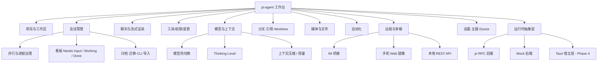
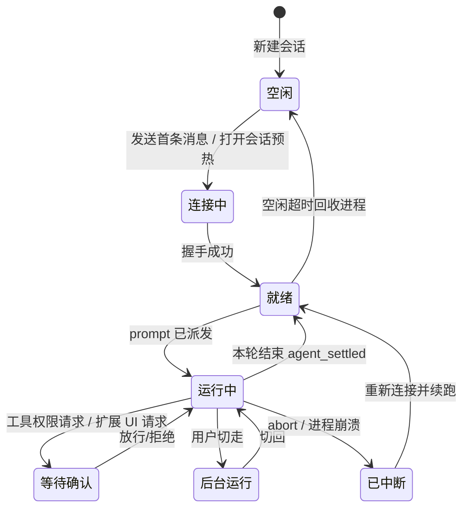

# pi-agent 产品需求文档（PRD）

| 项 | 内容 |
|---|---|
| **文档语言** | 简体中文 |
| **项目名称** | `pi_agent`（展示名 **pi-agent**） |
| **技术栈** | Vite + React + TypeScript + MUI + Tailwind CSS（Web 阶段）；Tauri 2（桌面阶段） |
| **被套壳的 Agent** | `pi`（`@mariozechner/pi-coding-agent` 系，badlogic/pi-mono，MIT），以 `--mode rpc` 驱动 |
| **参考产品** | [grok-app](https://github.com/RongleCat/grok-app)（Tauri 2 桌面工作台，本地代码已读：`reference-grok-app/`） |
| **文档版本** | **v1.1** · 2026-09-09（v1.0 初稿；v1.1 按实测校正协议描述、新增四档权限体系、确认本轮交付范围） |
| **作者** | 许清楚（产品经理） |

### 原始需求复述

> 用户原话：`pi-agent 参考 grok app。做一个 pi-agent，我给你 grokapp 的开源仓库 https://github.com/RongleCat/grok-app 可以参考这个`

已确认三项关键决策：

1. **交付形态**：最终为桌面 App，但**测试/开发阶段先做 Web 版**。架构上「Web 优先，预留 Tauri 层」——先跑通纯 Web 全链路，底层运行时抽象成接口，后续可无痛套 Tauri 2 壳。
2. **功能范围**：**完整对标 grok-app**（非 MVP）。grok-app 具备的功能模块在本 PRD 中全部列为需求，并叠加 pi 特有能力。
3. **后端对接**：**真实 `pi` CLI + Mock 双模**。默认驱动真实 `pi --mode rpc`；本机检测不到 `pi` 可执行文件时自动降级 Mock 后端，保证无环境也能开发、演示、测试。

**后续补充确认（v1.1 新增）**：

4. **权限档位体系**（用户拍板原话：「加进去吧，和别的 agent 一样，有完全访问权限、和重要修改时通知权限等等」）：四档 = 完全访问/YOLO · 重要修改时通知 · 逐次询问（**默认**）· 只读档。实现 = 内置 pi 扩展挂 `beforeToolCall` → `extension_ui_request` → 前端审批条 → `extension_ui_response`，`--tools` 做粗粒度兜底。→ §7.9
5. **本轮交付范围**（用户拍板）：**Web 全量（Phase 0–3）+ Tauri 2 桌面壳（Phase 4，需做成可运行/可安装，不是只留接口）**。→ §8
6. **协议实测校正**（用户本机 `pi` 0.85.0）：**不存在 `rpc-ui` 模式**（`--mode` 仅 text/json/rpc）；**无 `ready` 帧**，握手改为 `get_state` → `response`；`extension_ui_request` 字段可能含 ANSI 转义码。→ §6.5
7. **Web 阶段进程方案**：Phase 0–3 由**本地 Node host 服务** spawn `pi`；Phase 4 由 **Rust 宿主替换同一 `AgentRuntime` 接口**。→ Q12 已定稿

---

## 1. 产品定位

> **pi-agent 是 `pi` coding agent 的图形化工作台（GUI Workbench）。**

- **是**：本机 `pi` 的桌面/网页指挥台——管理项目、会话、模型、思考级别、权限、上下文与多任务并行。
- **不是**：本地 API 网关；不是模型厂商官方客户端；不打包任何模型权重。所有推理、工具执行都发生在用户本机已安装的 `pi` 上。

| 角色 | 定位 |
|---|---|
| **pi-agent（本项目）** | Agent IDE 壳：对话 + 工具可视化 + 权限 + 会话治理 + 多端接入 |
| **pi CLI** | 实际干活的 Agent 运行时（本项目通过 `--mode rpc` 的 NDJSON 协议驱动） |
| **Mock 后端** | 无 `pi` 环境时的等价替身，实现同一套运行时接口 |

**品牌与合规**：关于页必须写明「MIT 开源社区客户端，非 pi/pi-mono 官方产品」。

---

## 2. 目标用户与核心场景

### 2.1 目标用户

| 用户 | 特征 | 核心诉求 |
|---|---|---|
| **A. 重度 CLI Agent 用户** | 已在终端用 `pi`，熟悉 TUI | 想要更好的会话管理、可视化、并行与历史回溯 |
| **B. 多项目并行开发者** | 同时开 2～5 个仓库会话 | 互不串味、能同时跑、能看全局进度 |
| **C. 远程值守者** | 人不在电脑前 | 手机看进度、IM 下指令、定时任务自动跑 |
| **D. 中转/多模型用户** | 自建或购买 OpenAI 兼容中转、多 Provider | GUI 配 Key、选模型、测连通、看用量 |
| **E. 新手/演示者** | 没装 `pi` 或没配 Key | 打开就能看到完整交互（Mock 模式），降低体验门槛 |

### 2.2 核心场景

| # | 场景 | 描述 |
|---|---|---|
| S1 | **日常编码会话** | 打开项目 → 信任目录 → 对话 → 看思考/工具/回答 → 审阅改动 → 继续 |
| S2 | **并行多任务** | 3 个会话同时跑：A 重构、B 修 bug、C 写测试；切走后继续在后台流式，看板统一看状态 |
| S3 | **长会话治理** | 上下文接近上限 → 手动/自动压缩；从任意一轮分叉出新分支；回溯到旧节点 |
| S4 | **移动/远程值守** | 手机 Web 镜像看进度；IM 群里 `/p` 切项目、`/r` 恢复会话 |
| S5 | **自动化** | 每天 09:00 让 agent 跑一遍测试并汇总；自然语言一句话创建定时任务 |
| S6 | **接入第三方** | 脚本 / 其他工具通过本地 REST API 列出会话并对指定会话追加一轮 |
| S7 | **无环境演示** | 没装 `pi` 时自动进 Mock，可完整演示 UI 与交互链路 |

---

## 3. 产品目标（3 个正交目标）

| 目标 | 说明 | 可度量指标 |
|---|---|---|
| **G1 让 pi 的会话可治理** | 把终端里"一次性线性会话"变成可检索、可归档、可分叉、可回溯、可并行的资产 | 100+ 会话下侧栏列表滚动流畅（虚拟化）；从任意 assistant 轮次分叉成功率 100%；会话重开后上下文完整恢复 |
| **G2 让 Agent 行为可看见、可干预** | 思考、工具调用、进度、权限请求全部结构化呈现，并支持中途插话（steer）、排队（follow_up）、打断（abort） | 流式首字延迟 ≤ 500ms（本地渲染）；工具状态 3 秒内可见；运行中插话/终止成功率 100% |
| **G3 一次开发，双形态交付** | Web 全链路可跑通，运行时抽象成接口，Tauri 阶段只替换宿主能力不重写业务 | Web 版与桌面版共享 ≥ 90% 前端代码；Tauri 阶段不改动 `runtime/` 接口 |

---

## 4. 用户故事（按模块分组）

### 4.1 项目与工作区

- 作为**多项目开发者**，我希望把本地目录添加为项目并显式确认信任，以便 Agent 只在我授权的目录里读写。
- 作为**同时维护多个仓库的人**，我希望项目之间会话严格隔离，以便 A 项目的改动不会误落到 B 项目。
- 作为**整理控**，我希望把不活跃的会话归档、把会话迁移到别的项目，以便侧栏保持清爽。
- 作为**从终端迁移过来的用户**，我希望一键导入 `pi` CLI 的历史会话，以便不丢失已有工作上下文。

### 4.2 会话与并行

- 作为**并行工作者**，我希望多个会话同时运行且切走后仍在后台流式，以便不用干等一个任务。
- 作为**被长任务拖住的用户**，我希望在 Agent 运行中途追加一句纠正（steer）或排队一个后续（follow_up），以便及时调整方向。
- 作为**担心资源被吃光的用户**，我希望限制同时活跃的 Agent 进程数、并自动回收空闲进程，以便机器不卡。
- 作为**同时管很多任务的人**，我希望有一个看板（需要我处理 / 正在执行 / 已完成 / 空闲）总览所有会话，以便知道该先看哪个。

### 4.3 聊天与流式渲染

- 作为**需要理解 Agent 思路的人**，我希望思考过程、工具调用、最终回答按真实顺序流式呈现，以便知道它现在在干什么。
- 作为**阅读长回答的人**，我希望 Markdown（含表格横向滚动、代码高亮、可复制）渲染正确，以便快速扫读。
- 作为**要引用代码的人**，我希望用 `@` 搜索工作区文件插入引用、拖拽文件即引用路径、拖拽图片即上传，以便少打字。
- 作为**中途发现问题的人**，我希望随时 Stop 并在结束后继续追问，以便及时止损。

### 4.4 工具与权限

- 作为**关心安全的人**，我希望写文件/执行命令默认需要我确认（本次放行 / 本会话放行 / 拒绝），以便不会被误操作。
- 作为**赶时间的人**，我希望能把某个项目设为宽松策略（如自动接受编辑）甚至 YOLO，以便小改动不用反复点确认。
- 作为**要复盘的人**，我希望看到每个工具调用的输入、输出、耗时与失败原因，以便定位问题。
- 作为**审查代码的人**，我希望看到会话级变更的 Diff，并能单文件/批量接受或还原，以便掌控最终代码。

### 4.5 模型、思考级别与上下文

- 作为**追求性价比的人**，我希望在会话中途切换模型和思考级别（off/minimal/low/medium/high/xhigh），以便简单任务省钱、难题加码。
- 作为**跑长会话的人**，我希望看到上下文占用进度条，并能在接近上限时手动或自动压缩，以便不中断地继续。
- 作为**多 Provider 用户**，我希望在 GUI 里登录/配 Key、切换 Provider、测试连通，以便不用改配置文件。

### 4.6 会话分叉与引用

- 作为**想试不同方案的人**，我希望从任意一轮 assistant 回复处"从此处分叉"出新会话，以便不破坏主线地并行探索。
- 作为**需要复用上下文的人**，我希望把最多 3 个历史会话作为参考上下文附加到当前会话，以便让 Agent 借鉴已有结论。

### 4.7 Git Worktree

- 作为**多分支并行开发的人**，我希望在界面上看到项目的 worktree 列表并一键切换会话工作目录，以便不同分支互不干扰。
- 作为**要收尾的人**，我希望直接在应用内创建/删除 worktree、与 main 对比、推送并开 PR，以便不用来回切终端。

### 4.8 媒体与文件

- 作为**处理多模态内容的人**，我希望直接预览图片、视频、音频、PDF 与 Office 文档，以便不离开应用查看产物。
- 作为**要改细节的人**，我希望内置编辑器打开并编辑代码/文本文件并保存回磁盘，以便小改动不用切 IDE。

### 4.9 自动化

- 作为**想要定时任务的人**，我希望用一句自然语言（"每天早上 9 点跑一遍测试并汇总"）创建自动化任务，以便不用填表单。
- 作为**管理者**，我希望看到任务列表、启停、下次运行时间与运行历史，以便知道它到底跑了没有。

### 4.10 远程与移动端

- 作为**不在电脑前的人**，我希望用手机浏览器通过令牌登录后查看并继续会话，以便随时跟进。
- 作为**重度 IM 用户**，我希望在飞书/Telegram 等群里直接给本机 Agent 下指令（`/p` 切项目、`/r` 恢复会话），以便不打开电脑。
- 作为**写脚本的人**，我希望通过本机 REST API 列出会话并对指定会话追加一轮，以便把 Agent 串进自己的工具链。

### 4.11 设置与外观

- 作为**白天工作的人**，我希望默认亮色主题（并支持暗色/跟随系统），以便与我的 IDE 观感一致。
- 作为**出问题的人**，我希望有 Doctor 一键体检（pi 是否找到 / 鉴权 / Provider / 项目 / 日志路径），以便快速定位。

---

## 5. 产品功能地图



### 会话状态机（产品视角）



---

## 6. 技术前提：pi RPC 协议速查（供架构/研发对齐）

> 本节为**产品约束的事实基线**，不是架构设计。协议细节以用户本机 `pi` 版本为准，实现时需做能力探测与降级。
> **已实测基线（2026-09-09，用户本机 `pi` 0.85.0 / `@earendil-works/pi-coding-agent`）**：下列描述已按实测与官方类型定义校正，详见 §6.5。

### 6.1 启动与进程

```text
pi --mode rpc [--provider <p>] [--model <id>] [--name <n>] [--no-session]
              [--session <path|id>] [--session-dir <dir>] [--fork] [--tools a,b,c] [--offline]
```

**运行模式只有三种**（`pi --help` 原文：`--mode <mode>  Output mode: text (default), json, or rpc`）——**不存在 `rpc-ui` 模式**，其能力已合并进 `rpc` + `extension_ui_request` 子协议。

- 每会话对应一个 `pi --mode rpc` 子进程（进程模型对标 grok-app §I）。
- 协议为**严格 JSONL**：仅 `\n` 作分隔符；**禁止**用 Node `readline`（会在 U+2028/U+2029 处误切）。
- **无 `ready` 帧**：实测启动后不会输出 `ready`/握手帧（见 §6.5）。**就绪判据为：发送 `get_state` 并等待 `type:"response"` 回执**，同时以该回执内容作为能力探测依据。

### 6.2 主机 → pi（stdin 命令）

| 命令 | 关键参数 | 用途 | 对应产品能力 |
|---|---|---|---|
| `prompt` | `message`, `images[]`, `streamingBehavior`(`steer`/`followUp`) | 发送用户消息 | 发送消息、运行中插话、排队 |
| `steer` | `message`, `images[]` | 运行中插话（本轮工具结束后、下次 LLM 前送达） | 执行中追加引导 |
| `follow_up` | `message`, `images[]` | 排队，Agent 停下后再处理 | 追加后续消息队列 |
| `abort` | — | 中断当前请求/工具 | 停止生成 |
| `new_session` | `parentSession` | 开新会话 | 新建会话 |
| `get_state` | — | 当前模型/思考级别/是否流式 | 控制条回显 |
| `get_messages` | — | 完整对话历史 | 会话重载/导出 |
| `set_model` | `provider`, `modelId` | 切换模型 | 模型热切换 |
| `cycle_model` | — | 切下一个可用模型 | 快捷切换 |
| `get_available_models` | — | 列出已配置模型 | 模型下拉 |
| `set_thinking_level` | `level`: `off\|minimal\|low\|medium\|high\|xhigh` | 思考级别 | Thinking 控制 |
| `cycle_thinking_level` | — | 循环切换 | 快捷切换 |
| `set_steering_mode` / `set_follow_up_mode` | `mode`: `all\|one-at-a-time` | 队列投递策略 | 队列行为设置 |
| `compact` | `customInstructions` | 手动压缩上下文 | 手动压缩 |
| `set_auto_compaction` | `enabled` | 自动压缩开关 | 自动压缩设置 |
| `set_auto_retry` / `abort_retry` | `enabled` | 瞬时错误自动重试 | 稳定性设置 |
| `bash` / `abort_bash` | `command` | 执行 shell 并注入上下文 | 终端输入（`!cmd`） |
| `get_session_stats` | — | token / 费用 / 上下文窗口占用 | 用量与上下文 chip |
| `get_entries` / `get_tree` | `since` | 会话条目 / 条目树 | 分支树、回溯 |
| `fork` / `clone` | `entryId` | 从历史条目分叉 / 复制分支 | 会话分叉 |
| `get_fork_messages` | — | 可分叉的用户消息列表 | 分叉入口 |
| `switch_session` | `sessionPath` | 加载另一会话 | 会话切换/回溯 |
| `set_session_name` | `name` | 会话显示名 | 重命名 |
| `export_html` | `outputPath` | 导出 HTML | 会话导出 |
| `get_commands` | — | 可用命令（扩展命令/提示模板/技能） | 斜杠面板 |
| `get_last_assistant_text` | — | 最后一条助手文本 | 续跑/摘要 |
| `extension_ui_response` | `id`, `value` / `confirmed` / `cancelled` | **回复扩展 UI 请求（必须）** | 审批/选择器/输入框 |

### 6.3 pi → 主机（stdout 事件）

| 事件 | 说明 | 产品落点 |
|---|---|---|
| `response` | 命令回执（`success` + `id` 关联） | 请求-响应配对；**兼作就绪与能力探测判据**（`get_state` 回执） |
| `agent_start` / `agent_end` / `agent_settled` | 一轮运行开始 / 结束 / 完全稳定 | 轮次生命周期（`agent_settled` 才算真正结束） |
| `turn_start` / `turn_end` | 回合边界 | 时间线 |
| `message_start` / `message_update` / `message_end` | 流式增量（**delta-only**，`message_end` 为权威终态） | 流式渲染、思考/文本/工具调用增量 |
| `tool_execution_start` / `_update` / `_end` | 工具执行与进度 | 工具卡片、进度条 |
| `queue_update` | steer/follow_up 队列变化 | 队列条 |
| `compaction_start` / `compaction_end` | 压缩开始/结束 | 压缩横幅 |
| `auto_compaction_start` / `auto_compaction_end` | 自动压缩 | 自动压缩横幅 |
| `auto_retry_start` / `auto_retry_end` | 自动重试 | 重试提示 |
| `extension_error` | 扩展报错 | 错误面板 |
| `extension_ui_request` | **扩展 UI 请求**：`select` / `confirm` / `input` / `editor`（需响应，可带 `timeout` 自动兜底）；`notify` / `setStatus` / `setWidget` / `setTitle` / `set_editor_text`（即发即忘）。**`statusText` / `message` 等字段可能含 ANSI 转义码**，GUI 需剥离或转色 | 工具审批、选择器、输入框、状态栏、小组件 |

### 6.4 关键产品约束（重要）

0. **不存在 `rpc-ui` 模式**（实测定稿）。`pi --mode` 仅 `text` / `json` / `rpc` 三种；tool cards / 选择器 / 对话框一律走 `rpc` + `extension_ui_request` 子协议。**实现时不得依赖 `rpc-ui`。**
1. **pi 无内置权限系统 / 无沙箱**（核心刻意精简）。因此「写文件/执行命令需审批」**必须由 pi-agent 实现**——已定路径：随应用分发内置 pi 扩展挂 `beforeToolCall` → `ctx.ui.confirm/select` 发 `extension_ui_request` → 前端渲染审批条 → 回 `extension_ui_response`；`--tools` 启动参数做粗粒度兜底。（见 §7.9，原 Q3 已定稿）
2. **`message_update` 是增量（delta-only）**，主机需自行累积；`message_end` 才是权威终态。
3. **调用 `prompt` 时若 Agent 正在流式，必须显式给 `streamingBehavior`**，否则返回错误。UI 必须在运行中发送时明确区分「插话（steer）」与「排队（follow_up）」。
4. `agent_end` ≠ 轮次彻底结束（后面可能还有重试/压缩/排队），**以 `agent_settled` 为终态**。
5. **无 `ready` 帧，握手方式为「发 `get_state` 等 `response`」**。主机不得假设启动后会收到握手/能力广播；应以 `get_state` 回执（结合 `pi --version`）建立能力矩阵，并对缺失能力做 UI 降级。
6. **`extension_ui_request` 字段可能含 ANSI 转义码**（如 `setStatus.statusText`），GUI 必须剥离或转色后再渲染。
7. Windows 需重点防：路径空格、`spawn` 参数转义、Git/PATH 环境注入、CRLF。

### 6.5 实测证据（用户本机 `pi` 0.85.0）

```text
$ pi --mode rpc --no-session --offline
{"type":"extension_ui_request","id":"fadedc1b-…","method":"setStatus","statusKey":"mcp",
 "statusText":"\u001b[38;2;138;190;183m🔌 MCP: 3 servers enabled\u001b[39m"}
```

| 观察 | 结论 |
|---|---|
| 启动 7 秒内**只有**一帧 `extension_ui_request(setStatus)`，**无 `ready` 帧** | 握手不能用 `ready`；改用 `get_state` → `response` |
| `pi --help`：`--mode <mode>  Output mode: text (default), json, or rpc` | **无 `rpc-ui`**，相关能力并入 `rpc` + `extension_ui_request` |
| `statusText` 内嵌 ANSI 真彩色转义序列 | GUI 需 ANSI 剥离/转色 |
| MCP 状态以 `setStatus(statusKey:"mcp")` 下发 | 状态栏需支持按 `statusKey` 分组与清除（省略 `statusText` 即清除） |

---

## 7. 需求池

> 优先级：**P0 = 必须有（日用门槛）**；**P1 = 应该有（发布后增强，设计期预留 UI 位）**；**P2 = 可以有（锦上添花）**。
> 备注列标注 `[pi]`（pi 特有能力）、`[对标]`（来自 grok-app）、`[Web]`/`[Tauri]`（阶段约束）。

### 7.1 运行时与后端抽象（Runtime）

| # | 需求点 | 优先级 | 验收标准 | 备注 |
|---|---|---|---|---|
| R-01 | **运行时接口抽象**：定义统一 `AgentRuntime` 接口（start / send / steer / followUp / abort / setModel / setThinkingLevel / compact / fork / switchSession / respondExtensionUI / dispose / on(event)），业务层只依赖接口 | P0 | Mock 与真实后端可互换，业务代码零改动 | [pi] 架构底座 |
| R-02 | **真实 pi RPC 后端**：spawn `pi --mode rpc`，严格 JSONL 读写（禁 `readline`），命令 `id` 关联；**以「发 `get_state` 等 `response`」作为就绪与能力探测判据**（无 `ready` 帧） | P0 | 能完成一轮含工具调用的对话并正确渲染 | [pi] 已实测修正 |
| R-03 | **Mock 后端**：实现同一接口，模拟 `agent_start/message_update/tool_execution_*/agent_end` 全事件流、可配置延迟与错误注入 | P0 | 无 `pi` 环境下可完成完整演示与自动化测试 | 无环境可开发 |
| R-04 | **自动探测与降级**：启动探测 PATH + 常见路径 + 手动指定路径；未找到 `pi` → 自动降级 Mock 并在 UI 明确提示"当前为 Mock 模式" | P0 | 卸载/改名 `pi` 后应用仍可用且状态可见 | 决策 3 |
| R-05 | **强制模式开关**：设置页/环境变量可强制 real 或 mock | P0 | 覆盖自动探测结果 | |
| R-06 | **版本与能力探测**：读取 `pi --version`，维护能力矩阵（是否支持某命令/某事件），不支持的 UI 降级而非静默失败 | P1 | 老版本 `pi` 下不出现崩溃或静默无效 | [pi] |
| R-07 | **Windows 适配**：路径空格、参数转义、环境 PATH 注入、CRLF 处理、子进程优雅退出 | P0 | 含空格路径项目可正常打开与执行 | 用户为 Windows |
| R-08 | **诊断日志与脱敏**：结构化日志（可一键打开目录/复制脱敏报告），Key 与敏感内容强制 redact | P0 | 日志文件中不含任何明文凭据 | |
| R-09 | **CLI 安装引导**：未安装 `pi` 时给出 `npm i -g @mariozechner/pi-coding-agent` 等一键/复制命令与文档链接 | P1 | 用户可按引导完成安装并自动切回 real 模式 | [pi] |

### 7.2 工作台壳与主题

| # | 需求点 | 优先级 | 验收标准 | 备注 |
|---|---|---|---|---|
| S-01 | **三栏布局**：左侧栏（项目/会话）· 主区（聊天）· 右侧栏（上下文/任务/文件，可折叠），比例可拖拽并记忆 | P0 | 刷新后布局保持 | [对标] |
| S-02 | **亮色主题（默认）**：全页面、对话框、代码块、滚动条无漏白 | P0 | 遍历所有页面无异常色块 | 用户 IDE 为 light |
| S-03 | **暗色主题 + 跟随系统** | P0 | 一键切换并持久化 | [对标] |
| S-04 | **空状态**：无项目/无会话/无消息各有克制空状态与引导 | P0 | 不空白、不崩溃 | [对标] |
| S-05 | **自定义外观**：界面字体、终端/代码字体、壁纸（本地图片） | P2 | 可设置并持久化 | [对标] |
| S-06 | **快捷键体系**：发送、换行、停止、新建会话、切换会话、打开命令面板等可查看可配置 | P1 | 快捷键面板可查，冲突有提示 | [对标] |
| S-07 | **命令面板（Cmd/Ctrl+K）**：全局搜索会话/项目/设置项/命令 | P1 | 模糊搜索可跳转 | [对标] |

### 7.3 项目与工作区

| # | 需求点 | 优先级 | 验收标准 | 备注 |
|---|---|---|---|---|
| P-01 | **添加项目**：选择本地目录加入列表 | P0 | 加入后侧栏可见 | [对标] |
| P-02 | **目录信任确认**：首次打开项目弹信任确认；未信任不启动写权限 | P0 | 拒绝后 Agent 不写文件 | [对标] 安全默认 |
| P-03 | **最近打开排序 + 移除项目（不删磁盘文件）** | P0 | 重启后仍在；移除不删文件 | [对标] |
| P-04 | **路径异常标记**：目录被删/无权限时标红并可修复 | P0 | 可见且可修复 | [对标] |
| P-05 | **默认工作区**：未绑定项目的草稿会话落入默认工作区 | P0 | 无项目也能发起会话 | [对标] |
| P-06 | **会话归档**与**跨项目迁移**（含拖拽） | P1 | 迁移有确认提示；相对引用会提示风险 | [对标] |
| P-07 | **导入 pi CLI 历史会话**：扫描 `~/.pi/agent/sessions/`，导入为 App 会话（只读副本，不污染 CLI） | P1 | 导入后可读、可续跑 | [pi] |
| P-08 | **项目级规则文件**：识别并展示 `AGENTS.md` / context 文件，可编辑 | P1 | 展示并可保存 | [pi] |
| P-09 | **虚拟化列表**：100+ 会话滚动流畅 | P0 | 无明显卡顿 | [对标] |

### 7.4 会话管理

| # | 需求点 | 优先级 | 验收标准 | 备注 |
|---|---|---|---|---|
| C-01 | 新建 / 重命名 / 删除 / 搜索会话 | P0 | 均持久化 | [对标] |
| C-02 | 多会话严格隔离（消息、cwd、进程互不串） | P0 | 双会话交替发送不串消息 | [对标] |
| C-03 | **会话持久化**：UI 日志（App 侧）+ pi 会话文件（Agent 侧）双轨，重开优先 `switch_session` 恢复，失败则新建并用日志摘要引导 | P0 | 杀进程后重开，下一轮仍能延续上下文 | [pi][对标] |
| C-04 | **导出会话**（Markdown / HTML，后者直接复用 `export_html`） | P1 | 导出内容完整可读 | [pi] |
| C-05 | **复制会话 ID**（App 会话 ID 与 pi 会话 ID 双 ID 可区分） | P1 | 可复制，排查时可对应 | [对标] |
| C-06 | **会话固定（Pin）/ 标签** | P2 | 可置顶 | [对标] |
| C-07 | **会话查找（find in chat）**：当前会话内关键词高亮与跳转 | P1 | 命中可跳转 | [对标] |

### 7.5 并行与进程治理

| # | 需求点 | 优先级 | 验收标准 | 备注 |
|---|---|---|---|---|
| N-01 | **每会话一进程**，多会话并发运行 | P0 | 两会话同时流式输出互不干扰 | [对标] |
| N-02 | **并发上限**（默认 3，可配置），超限提示/排队 | P0 | 第 4 个有明确提示 | [对标] |
| N-03 | **空闲回收**（默认 30 分钟可配置），回收进程但保留会话元数据 | P0 | 回收后重开可恢复 | [对标] |
| N-04 | **后台持续流式**：切走的会话继续跑，侧栏/看板显示状态 | P0 | 切回后能看到完整输出 | [对标] |
| N-05 | **运行中插话（steer）**：`Ctrl+Enter` 发送插话消息 | P0 | 插话在下一次 LLM 调用前生效 | [pi] 核心 |
| N-06 | **追加后续队列（follow_up）**：运行中发送的消息进入队列，本轮结束后自动投递 | P0 | 队列条可见、可增删、可暂停 | [pi] 核心 |
| N-07 | **停止生成（abort）**：终止当前请求/工具，UI 回到可输入 | P0 | 停止后不残留"运行中"幽灵状态 | [pi] |
| N-08 | **流式不狂写盘**：落盘节流（≥500ms 或段落边界），轮次结束/停止强制 flush | P0 | 5 分钟对话无磁盘写入尖刺 | [对标] |
| N-09 | **流式 stall 检测**：长时间无事件显示"仍在运行/可能卡住"，提供结束本轮；不自动结束用户任务 | P0 | 提示可操作 | [对标] |
| N-10 | **工具心跳**：长工具执行期间周期心跳，避免被误判为 stall | P1 | 长 bash 不被误停 | [对标] |
| N-11 | **崩溃恢复**：进程死后提供"重新连接"，错误分类（CLI 未找到 / 鉴权失败 / 网络 / Agent 崩溃）互不混淆 | P0 | 四类错误文案正确 | [对标] |
| N-12 | **Ghost 流式自愈**：乐观发送未真正进入轮次时，超时后回滚并恢复草稿 | P1 | 不出现永久转圈 | [对标] |
| N-13 | **主聊天虚拟化**：长会话（≥48 条消息）虚拟滚动，保持贴底/回到底部 | P1 | 滚动不跳变 | [对标] |

### 7.6 看板（Kanban）

| # | 需求点 | 优先级 | 验收标准 | 备注 |
|---|---|---|---|---|
| K-01 | **四列看板**：需要我处理 / 正在执行 / 已完成 / 空闲 | P0 | 会话按实时状态自动归类 | [对标] |
| K-02 | 卡片展示：会话名、项目、状态、耗时、最后更新；点击直达会话 | P0 | 可跳转 | [对标] |
| K-03 | 按项目分组、搜索与筛选 | P1 | 可用 | [对标] |
| K-04 | 卡片上直接操作：继续 / 停止 / 处理审批 | P1 | 操作生效 | [对标] |

### 7.7 聊天与流式渲染

| # | 需求点 | 优先级 | 验收标准 | 备注 |
|---|---|---|---|---|
| T-01 | **结构化时间线**：思考 → 工具 → 回答按真实流式顺序渲染（非底部堆叠） | P0 | 顺序与事件一致 | [对标] |
| T-02 | **思考过程折叠**（默认折叠，可展开），标签为内容摘要或耗时，禁止"思考 1/2"编号 | P0 | 可折叠展开 | [对标] |
| T-03 | **工作阶段折叠**：连续思考+工具合并为一个可展开阶段 chip | P1 | 展开可见明细 | [对标] |
| T-04 | **Markdown 渲染**：代码块高亮 + 一键复制、表格横向滚动、链接、列表 | P0 | 渲染正确不溢出 | [对标] |
| T-05 | **流式渲染性能**：前端合并（~48ms）后 setState，无明显整段闪烁 | P0 | 长回答流畅 | [对标] |
| T-06 | **停止生成 / 重新生成** | P0 | 状态正确回到可输入 | |
| T-07 | **`Ctrl+Enter` 插话**，UI 明确区分插话与排队两种语义 | P0 | 行为符合协议约束 | [pi] |
| T-08 | **@ 文件引用**：模糊搜索工作区文件插入引用 | P0 | 可搜索插入 | [对标] |
| T-09 | **图片附件**（粘贴/选择/拖拽），走 `prompt.images` | P0 | 多图可发送 | [pi] |
| T-10 | **拖拽分流**：拖文件 = 路径引用；拖图片 = 上传附件 | P0 | 语义不混用 | [对标] |
| T-11 | **提示词历史**：本会话 ↑↓ 回溯 + 跨会话最近提示词（`/history`） | P1 | 可检索回填 | [对标] |
| T-12 | **代码选区引用**：从编辑器选中片段引用到输入框 | P2 | 可用 | [对标] |
| T-13 | **消息操作**：复制 / 引用 / 从此处分叉 / 删除后续 | P1 | 可用 | [对标] |
| T-14 | **结束轮次标记**：停止/中断/拒绝/崩溃各有统一结束 chip | P1 | 状态诚实 | [对标] |

### 7.8 工具调用可视化与变更

| # | 需求点 | 优先级 | 验收标准 | 备注 |
|---|---|---|---|---|
| W-01 | **工具卡片**：工具名、参数、状态（运行中/成功/失败）、耗时，可展开输入/输出 | P0 | 四类内置工具（read/write/edit/bash）+ grep/find/ls 均可呈现 | [pi] |
| W-02 | **工具进度流式**：`tool_execution_update` 输出实时增量（如 bash 输出） | P0 | 长命令输出实时可见 | [pi] |
| W-03 | **失败工具标记**：仅行内红点 + 简短提示，不做底部大块报错 | P1 | 视觉克制 | [对标] |
| W-04 | **上下文分组**：≥3 个连续 read/grep/find 折叠为"正在收集上下文" | P1 | 可折叠 | [对标] |
| W-05 | **只读工具集**：提供 `read,grep,find,ls` 只读模式（`--tools`），与权限档位④联动 | P1 | 生效且不误写 | [pi] 见 §7.9 档位④ |
| W-06 | **会话级变更 Diff 面板**：列出被改文件，单文件/批量接受、拒绝、还原 | P1 | 可审查可还原 | [对标] |
| W-07 | **内置编辑器**（CodeMirror 6）：多标签打开/编辑/保存，磁盘变更可从磁盘重载 | P1 | 编辑后保存生效 | [对标] |
| W-08 | **在外部编辑器/文件管理器打开** | P1 | 可打开 | Tauri 阶段增强 |
| W-09 | **工具统计**：本轮/本会话工具调用次数与耗时汇总 | P2 | 可见 | [对标] |

### 7.9 权限与审批（四档权限体系）

> 用户已拍板：「加进去吧，和别的 agent 一样，有完全访问权限、和重要修改时通知权限等等」。
> **实现路径（已定稿）**：内置 pi 扩展挂 `beforeToolCall` → `ctx.ui.confirm/select` 发 `extension_ui_request` → 前端渲染审批条 → 回 `extension_ui_response`；**`--tools` 启动参数做粗粒度兜底**。
> **硬规则**：支持超时自动兜底；**严禁 `window.alert` / `confirm` / `prompt`**，一律应用内组件；**YOLO 不得作为全局默认**。

#### 7.9.1 四档权限定义

| 档位 | 行为 | 默认性 | 对应启动/协议手段 |
|---|---|---|---|
| **① 完全访问 / YOLO** | 不询问，全部放行 | **需二次确认才能开启，不得作为全局默认** | 扩展侧不再发 `extension_ui_request`，全部 auto-confirm |
| **② 重要修改时通知** | 自动放行常规编辑与命令；**仅对危险操作弹审批** | 可选（可设为项目级默认） | 扩展按危险命令清单判定，命中才发 `confirm` |
| **③ 逐次询问（默认档）** | 写文件 / 执行命令都问：单次放行 / 本会话放行 / 拒绝 | **默认档** | 每次 `beforeToolCall` 命中写/执行类即发 `confirm`/`select` |
| **④ 只读档** | 禁止一切写与执行 | 可选 | `--tools read,grep,find,ls`，扩展侧二次拦截 |

**危险操作清单（档位②判定依据，示例，需可配置）**：

| 类别 | 示例 |
|---|---|
| 删除 / 破坏性 | `rm -rf`、`rm` 带 `-r/-f`、`git clean -fd`、`del /s`、`Remove-Item -Recurse` |
| Git 破坏性 | `git push --force` / `-f`、`git reset --hard`、`git checkout .`、`git branch -D`、`git rebase` 改写已推送历史 |
| 权限提升 | `sudo`、`runas`、`sudoers` 修改、`chmod 777`、`chown` |
| 系统/项目外写入 | 写入项目目录之外、写入系统目录、`/etc`、`C:\Windows`、用户主目录点文件 |
| 网络副作用 | `curl | sh`、`wget -O- \| bash`、安装全局包（`npm i -g`）、`pip install` 到系统环境 |
| 凭据与密钥 | 读取/写入 `.env`、SSH 私钥、token 文件、云凭据 |
| 进程与服务 | `kill -9`、杀掉非本会话进程、启停系统服务 |
| 数据库 | `DROP` / `TRUNCATE` / `DELETE` 无 `WHERE`、迁移回滚 |

#### 7.9.2 需求条目

| # | 需求点 | 优先级 | 验收标准 | 备注 |
|---|---|---|---|---|
| A-01 | **档位① 完全访问 / YOLO**：不询问全部放行；入口在设置与会话控制条，**开启需二次确认**（明确风险文案），且**不得作为全局默认项** | P0 | 开启有二次确认；新装默认不是 YOLO；开启后不再弹审批 | 用户拍板·[对标] |
| A-02 | **档位② 重要修改时通知**：常规编辑与命令自动放行，命中危险操作清单才弹审批（清单可见、可增删） | P0 | 常规编辑无打扰；`rm -rf`/`--force`/`sudo` 等必定弹窗 | 用户拍板·[对标] |
| A-03 | **档位③ 逐次询问（默认档）**：写文件/执行命令均弹审批条，三选项 **单次放行 / 本会话放行 / 拒绝** | P0 | 新装默认命中此档；三类操作结果正确回传 | 默认档·[对标] |
| A-04 | **档位④ 只读档**：`--tools read,grep,find,ls` + 扩展侧二次拦截，禁止一切写与执行 | P0 | 该档下 write/edit/bash 均被拦截且不落盘 | [pi] 安全 |
| A-05 | **档位切换与记忆**：支持 全局 / 项目 / 会话 三级作用域；切换后 toast 说明生效路径（立即生效 or 下条消息/重连后生效），不静默失败 | P0 | 三档作用域可分别设置且生效可见 | [对标] |
| A-06 | **审批交互协议**：基于 `extension_ui_request`(`confirm`/`select`) + `extension_ui_response`；支持 `timeout` 自动兜底（按默认值解析），**严禁 `window.alert/confirm/prompt`** | P0 | 响应正确；超时按默认值处理且不卡死轮次 | [pi] |
| A-07 | **内置审批扩展**：随应用分发内置 pi 扩展，挂 `beforeToolCall`，按当前档位决定是否发起 UI 请求；支持危险命令模式匹配与可配置清单 | P0 | 四类工具均能被正确拦截/放行；扩展缺失时给出可行动提示 | [pi] 需自建 |
| A-08 | **审批条 UI**：内嵌于消息流，展示工具名、目标路径/命令、风险级别、三个操作按钮；危险操作用醒目样式 | P0 | 可读性 + 可操作，无系统原生弹窗 | [对标] |
| A-09 | **后台会话审批**：切走后审批请求保留在该会话，重开仍可处理；期间有 toast/桌面通知提醒 | P1 | 不丢失审批，切回可继续处理 | [对标] |
| A-10 | **审批审计日志**：记录时间、会话、工具、参数摘要、档位、结果（放行/拒绝/超时兜底），可导出；**不含敏感明文** | P1 | 可查可导出，无凭据明文 | 新增 |
| A-11 | **扩展选择器/输入框渲染**：`select` / `input` / `editor` 渲染为应用内选择器/输入框/多行编辑器 | P1 | 三种均可用 | [pi] |
| A-12 | **即发即忘 UI**：`notify`→toast；`setStatus`→状态栏（按 `statusKey` 分组，省略 `statusText` 即清除）；`setWidget`→输入框上/下方小组件；**需剥离 ANSI 转义码** | P2 | 可呈现，无乱码控制字符 | [pi] 实测含 ANSI |
| A-13 | **危险命令清单可配置**：设置页提供默认清单 + 用户自定义正则/关键字，支持项目级覆盖 | P2 | 可增删并生效 | 新增 |
| A-14 | **审批超时策略可配**：默认超时值与"超时即拒绝/即放行"策略可设置，默认**超时即拒绝**（保守） | P2 | 可配置，默认保守 | 新增 |

### 7.10 模型、思考级别与上下文

| # | 需求点 | 优先级 | 验收标准 | 备注 |
|---|---|---|---|---|
| M-01 | **模型选择**：`get_available_models` 填充下拉，可切换，`set_model` 中途生效 | P0 | 切换后下一轮生效且不静默失败 | [pi] |
| M-02 | **Thinking Level 控制**：off/minimal/low/medium/high/xhigh 六档，中途 `set_thinking_level`；不支持时 UI 降级 | P0 | 六档可见，不支持时隐藏/禁用并说明 | [pi] 特有 |
| M-03 | **思考级别可见性**：编辑器边框/控制条颜色指示当前档位（对标 pi TUI） | P1 | 可见 | [pi] |
| M-04 | **生效路径诚实提示**：切换后 toast 说明是"下条消息生效"还是"立即生效" | P1 | 有提示 | [对标] |
| M-05 | **上下文占用 chip**：基于 `get_session_stats` 展示 token / 费用 / 上下文占比 | P1 | 数据真实 | [pi] |
| M-06 | **手动压缩**：确认后发 `compact`（可带自定义指令） | P1 | 生效并展示压缩横幅 | [pi] |
| M-07 | **自动压缩开关 + 自动压缩横幅**（`auto_compaction_start/end`，含 before→after 与摘要） | P1 | 横幅可见 | [pi] |
| M-08 | **自动重试开关 + 重试提示**（`auto_retry_start/end`） | P2 | 可见 | [pi] |
| M-09 | **偏好记忆范围**：模型/思考级别/权限可按 全局 / 项目 / 会话 三档记忆 | P2 | 可配置 | [对标] |
| M-10 | **模型路由（辅槽）**：为摘要/提示建议等轻量任务指定廉价模型 | P2 | 可配置 | [对标] |

### 7.11 会话分叉、引用与分支树

| # | 需求点 | 优先级 | 验收标准 | 备注 |
|---|---|---|---|---|
| F-01 | **从此处分叉**：在已完成的 assistant 轮次上分叉出新会话，复制到该用户轮次为止的上下文 | P0 | 新会话上下文正确截断，源会话不变 | [pi `fork`][对标] |
| F-02 | **可分叉点列表**：`get_fork_messages` 展示可回溯的用户消息 | P1 | 可选择 | [pi] |
| F-03 | **分支树视图**：`get_tree` 可视化会话条目树，支持导航/回溯（`switch_session`） | P1 | 树可读可跳转 | [pi] 特有 |
| F-04 | **克隆会话**（`clone`） | P2 | 可用 | [pi] |
| F-05 | **附加参考会话**：最多 3 个；`/attach-chat` 或侧栏图标/拖拽；发送时展开为紧凑上下文前缀（每会话最近 16 轮、~2k 字/轮） | P1 | 上限 3，chip 可点击跳转源会话 | [对标] |
| F-06 | **引用 chip 提示**：源会话有新消息时提示"发送时包含最新内容" | P2 | 可见 | [对标] |

### 7.12 Git Worktree

| # | 需求点 | 优先级 | 验收标准 | 备注 |
|---|---|---|---|---|
| G-01 | **分支 chip**：`git worktree list --porcelain` 列出 worktree，可绑定为会话 cwd；非 git 目录隐藏 chip | P1 | 可用，非 git 不显示 | [对标] |
| G-02 | **创建 worktree**：填名称 + 位置（CLI home 默认 / 同级）+ 起始点（分支/tag/commit），argv 调用不走 shell | P1 | 创建成功并绑定 | [对标] |
| G-03 | **删除 worktree**（禁删 main，dirty 时二次确认 force）与 **GC/prune** | P2 | 主 worktree 不可删 | [对标] |
| G-04 | **与 main 对比**：`git diff --name-status` 文件清单（A/M/D/R 徽章，上限 500 + 诚实溢出提示） | P2 | 可读 | [对标] |
| G-05 | **侧栏 WT 徽章**：worktree 会话显示徽章与路径提示 | P2 | 可见 | [对标] |
| G-06 | **推送并开 PR**（`git push -u` + `gh pr create`，失败必须给出真实错误，无 URL 不报成功） | P2 | 成功返回 PR 链接 | [对标] |

### 7.13 媒体与文件

| # | 需求点 | 优先级 | 验收标准 | 备注 |
|---|---|---|---|---|
| D-01 | **图片预览**：点击放大、缩放、复制；聊天内缩略图懒加载（性能） | P0 | 大图不卡 | [对标] |
| D-02 | **本地媒体投递**：通过回环 HTTP/对象 URL 提供本地文件预览，产品层不直接用 `file://` | P0 | 可预览且路径受控 | [对标] |
| D-03 | **视频 / 音频播放** | P1 | 可播放 | [对标] |
| D-04 | **PDF 预览** | P1 | 可读 | [对标] |
| D-05 | **Office 预览**（docx / xlsx / pptx） | P2 | 可读 | [对标] |
| D-06 | **分享长图导出**：把一轮问答导出为图片 | P2 | 可导出 | [对标] |
| D-07 | **附件与路径引用卡片**：工具产出的文件路径渲染为可点击卡片（打开/复制/在文件夹显示） | P1 | 可用 | [对标] |

### 7.14 pi 扩展、技能与提示模板

| # | 需求点 | 优先级 | 验收标准 | 备注 |
|---|---|---|---|---|
| X-01 | **斜杠命令面板**：输入 `/` 唤起，聚合扩展命令 / 提示模板 / 技能 / 内置动作，↑↓ 选择、Enter 应用、Esc 关闭 | P0 | 数据来自 `get_commands` | [pi] |
| X-02 | **技能 chip**：技能以内联 chip 插入草稿，发送时序列化为 `/name` | P1 | 发送内容正确 | [pi][对标] |
| X-03 | **扩展管理面板**：列出已安装扩展，启用/禁用（项目级与全局） | P1 | 可切换 | [pi] |
| X-04 | **提示模板管理**：列出/预览/插入 | P1 | 可用 | [pi] |
| X-05 | **主题（Theme）选择与预览** | P2 | 可切换 | [pi] |
| X-06 | **pi 包（packages）安装入口**：从 npm/git 安装扩展与技能包 | P2 | 可安装并热加载 | [pi] |
| X-07 | **技能目录自动刷新**：会话中安装新技能后自动重载面板（~900ms 防抖） | P2 | 无需重启 | [对标] |

### 7.15 自动化（已安排任务）

| # | 需求点 | 优先级 | 验收标准 | 备注 |
|---|---|---|---|---|
| U-01 | **手动创建表单**：标题 / 指令 / 项目 / 模型 / 思考级别 / 频率 / 时间 / 通知 | P1 | 可创建并持久化 | [对标] |
| U-02 | **自然语言创建**：一句话描述"做什么 + 何时跑" → Agent 回复含结构化 fence → 界面剥离 fence 并落库（用户不可见 JSON） | P1 | 气泡中不显示配置块 | [对标] |
| U-03 | **任务列表**：搜索 / 启停 / 编辑 / 删除 / 下次运行时间 | P1 | 可用 | [对标] |
| U-04 | **应用存活时触发**：进程内定时检查到期任务；任一会话忙时不抢跑，空闲后补跑 | P1 | 到期可触发 | [对标] |
| U-05 | **运行历史（诚实）**：本地 ring（~50 条）记录触发结果（ok/error/skipped）；**不虚构"退出后仍跑过"** | P1 | 空态文案诚实 | [对标] |
| U-06 | **状态说明**：明确"需 App/托盘存活"；不宣称无 UI 守护进程 | P1 | 文案准确 | [对标] |
| U-07 | **托盘常驻（Tauri 阶段）**：有启用任务时关窗最小化到托盘 | P2 | 可用 | [Tauri] |

### 7.16 IM 桥接（远程控制）

| # | 需求点 | 优先级 | 验收标准 | 备注 |
|---|---|---|---|---|
| I-01 | **桥接服务**：独立 Node 桥接进程（参考 grok-app `remote-bridge`），GUI 负责配置与启停 | P2 | 可启动/停止 | [对标] |
| I-02 | **渠道配置 GUI**：飞书/Lark 首发，后续扩展 Telegram / Slack / Discord / 钉钉 / 企业微信 / 微信个人 / QQ / Matrix / LINE / 微博 | P2 | 至少一个渠道可收发 | [对标] 11+ 渠道 |
| I-03 | **ACL 与项目范围**：白名单（用户/群）+ 允许的项目目录 | P2 | 未授权不响应 | [对标] |
| I-04 | **IM 内命令**：`/p` 切项目、`/r` 恢复会话、`/new` 新建、`/stop` 停止、`/status` 状态 | P2 | 命令生效 | [对标] |
| I-05 | **扫码/绑定状态机 + 多实例** | P2 | 状态可见 | [对标] |
| I-06 | **回复流式与节流**：长输出分片回传 | P2 | 不刷屏 | [对标] |

### 7.17 移动端 Web 镜像

| # | 需求点 | 优先级 | 验收标准 | 备注 |
|---|---|---|---|---|
| B-01 | **手机 Web 镜像**：令牌门禁的轻量移动界面（会话列表 + 只读/可写切换） | P1 | 手机浏览器可访问 | [对标] |
| B-02 | **二维码连接**：展示二维码与地址，写权限默认关闭，可单独开启并记录审计 | P1 | 可扫码连接 | [对标] |
| B-03 | **写操作 ACL 审计**：写权限开启/关闭、令牌轮换记录（不存密钥） | P1 | 可查 | [对标] |
| B-04 | **最大客户端数限制** | P2 | 超限拒绝 | [对标] |
| B-05 | **公网隧道（Cloudflare Quick Tunnel）**：可选开启，失败给出可诊断信息 | P2 | 可用/失败有提示 | [对标] |
| B-06 | **移动端适配布局**：单栏、底部工具抽屉、项目选择 | P1 | 可用 | [对标] |

### 7.18 本地 REST API

| # | 需求点 | 优先级 | 验收标准 | 备注 |
|---|---|---|---|---|
| E-01 | **回环 HTTP 服务**：仅绑定 127.0.0.1，令牌门禁，令牌文件写盘（权限收紧），设置页只给"打开令牌文件位置" | P1 | 非回环不可访问 | [对标] |
| E-02 | `GET /v1/health` | P1 | 返回 `ok` 与 `connectLockBusy` | [对标] |
| E-03 | `GET /v1/sessions?include_archived=` | P1 | 返回 id/title/project/updatedAt/archived/pinned | [对标] |
| E-04 | `POST /v1/sessions/{id}/turns`（body: `prompt`, `idempotencyKey?`），会话忙时**入跟进队列不打断**，返回 `turn_started`/`queued`/`not_found`/`retry_later`/`error` | P1 | 状态码语义正确 | [对标] |
| E-05 | **幂等键**（命中回放上次结果，磁盘上限 200） | P2 | 重复提交幂等 | [对标] |
| E-06 | **CLI 入口**：`pi-agent --sessions` / `--session-send <id> --prompt "…"`（不抢窗口焦点） | P2 | 可用 | [对标] |

### 7.19 账号、Provider 与用量

| # | 需求点 | 优先级 | 验收标准 | 备注 |
|---|---|---|---|---|
| Q-01 | **登录方式**：引导使用 `pi /login`（OAuth/订阅）或设置环境变量 API Key；提供"使用现有 CLI 登录"入口 | P0 | 能完成鉴权 | [pi] |
| Q-02 | **Provider 管理**：列出 15+ 内置 Provider，可配置/切换/测试连通；自定义 Provider（OpenAI/Anthropic/Google 兼容，写 `~/.pi/agent/models.json`） | P1 | 可配置并 ping | [pi] |
| Q-03 | **密钥安全**：优先系统钥匙串；本地回退加密存储 0600；**日志强制脱敏** | P0 | 日志无明文 | [对标] |
| Q-04 | **用量统计**：基于 `get_session_stats` 累计 token / 费用 / 上下文，按会话与项目维度 | P1 | 数据真实 | [pi] |
| Q-05 | **消耗热力图**：按日/按时段展示活动强度与消耗 | P1 | 可读 | [对标] |
| Q-06 | **多账号快速切换** | P2 | 可切换 | [对标] |
| Q-07 | **额度/订阅信息**：仅在 Provider 提供时展示，不可得时诚实显示"不可用" | P2 | 不虚构 | [对标] |

### 7.20 设置与 Doctor

| # | 需求点 | 优先级 | 验收标准 | 备注 |
|---|---|---|---|---|
| V-01 | **设置分区**：账户与 Provider / 模型与默认 / 会话数据模式 / 外观与语言 / Agent 运行时 / 关于与更新 | P0 | 分区齐全 | [对标] |
| V-02 | **Doctor 一键体检**：pi 是否找到、版本、鉴权、Provider 连通、项目可写、日志路径；pass/warn/fail 结构化展示 + 复制脱敏报告 + 重跑 | P0 | 多入口同一弹窗 | [对标] |
| V-03 | **打开日志目录 / 数据目录** | P0 | 可打开 | [对标] |
| V-04 | **关于页**：版本、MIT、非官方声明、参考项目链接 | P0 | 可见 | [对标] |
| V-05 | **设置搜索与深链**（`#/settings/xxx`） | P2 | 可跳转 | [对标] |
| V-06 | **中/英双语**（后续可扩展多语言） | P1 | 覆盖导航/设置/错误/Doctor | [对标] |
| V-07 | **遥测默认关闭**，如启用必须 opt-in | P0 | 默认关 | [对标] 合规 |

### 7.21 Tauri 桌面封装（Phase 4 · **本轮为交付范围，需做成可运行**）

> 用户拍板：**Web 全量 + Tauri 壳**。Phase 4 不是"只留接口"，而是要把 Tauri 2 桌面壳做成**可运行、可安装**的成品（自绘窗控、托盘、通知、安装包配置齐备）。

| # | 需求点 | 优先级 | 验收标准 | 备注 |
|---|---|---|---|---|
| Z-01 | **Tauri 2 壳**：复用 Web 全部前端，宿主能力（进程 spawn / 文件系统 / 钥匙串 / 通知 / 窗口）经接口注入 | P0 | Web 与桌面共用同一份前端产物 | 决策 1 |
| Z-02 | **无边框圆角窗口 + 自绘窗控**（Windows 最小化/最大化/关闭 + 拖拽 hit-test） | P0 | Windows 无死区 | 本轮必做 |
| Z-03 | **系统托盘 + 关窗到托盘** | P0 | 关窗可到托盘，托盘菜单可用 | 本轮必做 |
| Z-04 | **桌面通知**（审批/完成提醒，点击直达会话） | P0 | 可发出并点击直达会话 | 本轮必做 |
| Z-06 | **安装包配置**：Windows `.msi`/安装版 + portable；macOS `.dmg`（arm64 + x64） | P0 | 构建产物可安装启动 | 本轮必做 |
| Z-05 | **自动更新**（Tauri updater 通道配置） | P1 | 通道配置就绪可更新 | |
| Z-07 | **开机自启 / 登录启动** | P1 | 可用 | |
| Z-08 | **SSH 远端工作区**（远端会话/文件/终端，路径不得当本地盘） | P2 | 可用 | [对标] |
| Z-09 | **桌面宠物（趣味）** | P2 | 可开关 | **[已移出本轮范围 → 见 §7.22]** |
| Z-10 | **钥匙串集成**：密钥迁移到系统钥匙串（Windows Credential Manager / macOS Keychain） | P0 | 密钥不落明文文件 | 本轮必做（配套 Q-03） |

### 7.22 非目标（明确不做）

| 不做 | 原因 |
|---|---|
| 内嵌/打包 `pi` 运行时 | 体积与许可复杂度；走探测 + 引导安装 |
| **桌面宠物（Z-09）** | **与「Web 全量 + Tauri 壳」的全量范围冲突且无功能价值，本轮移出范围**（原 P2 趣味项） |
| 本地 API 网关（中转转发服务） | 定位不同，Provider 配置已够用 |
| 云端 multi-agent farm / best-of-n | 范围过大 |
| `/share` 公网分享会话 | 安全与合规成本 |
| 完整内嵌终端（PTY） | 成本高且非主路径；提供只读输出与 `bash` 命令注入即可 |
| 企业 SSO / 团队协作 | 首版不主打 |
| 默认 YOLO 全放行 | 安全默认值必须保守（YOLO **可作可选项**，但必须二次确认且不得为全局默认，见 A-01） |
| `--mode rpc-ui` 相关能力 | **实测该模式不存在**（`pi --mode` 仅 text/json/rpc），全部并入 `rpc` + `extension_ui_request` |

---

## 8. 分层交付路线

> 原则：**Web 先行 → 抽象稳定 → Tauri 套壳**。需求池完整，但 Phase 决定实现顺序。
> **本轮交付范围（用户已拍板）：Web 全量（Phase 0–3 全部功能）+ Tauri 2 桌面壳（Phase 4，需做成可运行/可安装，而非只留接口）。**

| Phase | 目标 | 交付内容 | 出口标准 | 本轮 |
|---|---|---|---|---|
| **Phase 0 · Mock 骨架** | 跑通纯 Web UI 全链路 | 运行时接口 `AgentRuntime` + Mock 后端；三栏壳 + 亮/暗主题；项目/会话 CRUD；聊天时间线（思考/工具/回答）；斜杠面板雏形；设置与亮色主题 | 无 `pi` 环境也能完整演示一轮"含工具调用"的对话 | ✅ 交付 |
| **Phase 1 · 真实 pi 打通** | 接真后端 | `pi --mode rpc` 后端（JSONL、命令/事件全映射；**`get_state`→`response` 握手**）；进程治理（并发上限/空闲回收/后台流式）；streamingBehavior（steer/follow_up）与 abort；上下文压缩与 `get_session_stats`；模型与 Thinking Level 切换；Doctor | 真实环境下完成 M01 剧本（安装→登录→开项目→含工具的一轮对话） | ✅ 交付 |
| **Phase 2 · 治理与并行增强** | 日用就绪 | 看板四列；工具卡片与进度；**四档权限体系（内置审批扩展 + `extension_ui_request` + `--tools` 兜底）**；会话分叉与分支树；`attach-chat`；媒体预览与本地媒体投递；归档/迁移/CLI 会话导入 | 双会话隔离、后台续跑、**四档审批均按定义拦截/放行**、分叉上下文正确 | ✅ 交付 |
| **Phase 3 · 多端与自动化** | 远程与自动 | 自动化任务（表单 + 自然语言创建 + 触发 + 运行历史）；本地 REST API + CLI 入口；手机 Web 镜像（二维码 + 令牌 + 写 ACL）；Git worktree 基础（列表/切换/创建）；扩展/技能/模板管理；用量统计与热力图 | 手机可查看并追问；脚本可对指定会话追加一轮 | ✅ 交付 |
| **Phase 4 · Tauri 桌面化** | 交付桌面 App | Tauri 2 壳接入（宿主能力接口替换）；**自绘窗控与无边框**；**托盘与桌面通知**；**安装包配置**；**钥匙串集成**；自动更新通道；IM 桥接（独立 Node 桥接进程 + GUI 配置，飞书首发，P2 可按期后延）；SSH 远端（P2） | Web 前端代码复用率 ≥ 90%；**Windows 可安装启动并完整跑通一轮对话** | ✅ **交付（本轮范围内）** |

**Phase 与 Web/Tauri 的对应**：Phase 0–3 全部为 **Web 版**——浏览器可跑，通过**本地 Node host 服务** spawn `pi`（见 Q12 已定稿）；Phase 4 由 **Rust 宿主替换同一 `AgentRuntime` 接口**，**不重写业务逻辑**。
**本轮不含**：桌面宠物（Z-09，已移至 §7.22 非目标）；SSH 远端（Z-08）与 IM 桥接全渠道（I-02 除飞书外）作为 P2，允许在桌面壳交付后继续补齐。

---

## 9. UI 设计稿描述

### 9.1 主界面线框（三栏 · 亮色主题）

```text
┌─────────────────────────────────────────────────────────────────────────────────────┐
│ pi-agent  [项目: my-app ▾] [分支: main ▾]  [模型 ▾] [思考: high ▾] [权限: 逐次询问 ▾]  ⚙ ─ □ ✕│
├──────────────┬────────────────────────────────────────────┬──────────────────────────┤
│ ≡ 工作台      │                                            │ 上下文 / 变更 / 分支       │
│ ───────────── │  ┌────────────────────────────────────┐   │ ┌──────────────────────┐ │
│ 🔍 搜索会话    │  │ 👤 帮我重构 auth 模块，加上 OAuth    │   │ [变更][任务][分支树]   │ │
│ ───────────── │  ├────────────────────────────────────┤   │ ────────────────────── │ │
│ 项目          │  │ 🤖 ▸ 思考 3.2s              ⌄      │   │ 已修改 (3)             │ │
│  ▾ my-app     │  │    ▸ read  src/auth.ts       ✓     │   │  M  src/auth.ts        │ │
│    ● 重构 auth │  │    ▸ grep "session"         ✓     │   │  A  src/oauth.ts       │ │
│    ● 修 bug   │  │    ▸ bash  npm test          ● 12s │   │  M  test/auth.spec.ts  │ │
│    ○ 写测试   │  │  我先看一下 auth 相关实现…            │   │  [全部接受] [全部还原]  │ │
│  ▾ pi-agent   │  │ ```ts                               │   │ ────────────────────── │ │
│    ● 写 PRD   │  │ export function login() { … }        │   │ 上下文  ▓▓▓▓▓▓░░ 68%  │ │
│  ▾ default    │  │ ```                                 │   │ [手动压缩] 自动压缩 ✓   │ │
│    ○ 草稿     │  ├────────────────────────────────────┤   │ ────────────────────── │ │
│ ───────────── │  │ ⚠ 允许写入 src/oauth.ts ?           │   │ 分支                   │ │
│ 📋 看板   3/1 │  │   [单次放行] [本会话放行] [拒绝]      │   │  ● main                │ │
│ ⏰ 已安排   2 │  ├────────────────────────────────────┤   │  └─ fork @ turn 3       │ │
│ 📦 归档      │  │ ┌────────────────────────────────┐  │   │                        │ │
│ ───────────── │  │ │ 输入消息…  / 命令  @ 引用  📎  ⚡ │  │   │                        │ │
│ [+ 新建会话]  │  │ │                      [发送 ⏎]  │  │   │                        │ │
│ [+ 添加项目]  │  │ └────────────────────────────────┘  │   │                        │ │
│ ───────────── │  │ 运行中：追加 ▸ [插话] [排队] [停止]   │   │                        │ │
│ 🔧 pi v0.x ✓  │  │                                    │   │                        │ │
└──────────────┴────────────────────────────────────────────┴──────────────────────────┘
```

### 9.2 关键区域说明

| 区域 | 说明 |
|---|---|
| **顶部标题栏** | 左：项目选择器 + Git 分支/worktree chip。中：预留标题/状态。右：**权限档位 chip（①完全访问 / ②重要修改时通知 / ③逐次询问 / ④只读，默认③，选①需二次确认）** + 模型、思考级别 chip，其后设置齿轮。Windows 桌面阶段为自绘窗控（最小化/最大化/关闭）。 |
| **左侧栏** | 上：搜索框；中：项目树（每个项目下会话列表，虚拟化，状态点：● 运行中 / ○ 空闲 / ⚠ 待处理）；下：看板、已安排、归档入口；底：新建会话/添加项目按钮 + `pi` 状态指示（版本 / Mock 徽章）。 |
| **主区 · 消息流** | 按真实顺序渲染：思考（可折叠，标签为摘要或耗时）→ 工作阶段（连续工具折叠为 chip）→ 回答正文（Markdown）。长列表虚拟化，保持贴底；右下"回到底部"。 |
| **主区 · 审批条** | 内嵌在消息流中的工具审批 / 扩展选择器 / 输入框。**禁止 `window.alert/confirm/prompt`**，一律应用内组件。 |
| **主区 · 输入区** | 上：上下文条（项目 chip、附加会话 chip、技能 chip、附件）。中：多行编辑器（Enter 发送 / Shift+Enter 换行 / Ctrl+Enter 插话）。下：工具行（`/` 命令、`@` 引用、附件、技能、思考级别快捷）。运行中显示"插话 / 排队 / 停止"。 |
| **右侧栏（可折叠）** | 三个 Tab：**变更**（会话级 Diff，接受/拒绝/还原）· **任务**（本轮工具与子任务）· **分支树**（pi 会话条目树，可跳转/分叉）。底部常驻上下文占用条 + 压缩控制。 |

### 9.3 视觉基调

- **亮色为主**（用户 IDE 为 light 主题）：浅灰白底 + 中性分隔线 + 单一强调色（建议蓝/青），卡片圆角 8–12px，克制阴影。
- 状态色语义固定：运行中（蓝，脉冲）· 成功（绿）· 待处理/警告（橙）· 失败（红，仅小圆点或短提示，不做大块告警）。
- 代码块等宽字体 + 语法高亮 + 一键复制；Markdown 表格横向滚动不撑破布局。
- 暗色主题为同一套设计令牌的反转，**所有组件/对话框/滚动条无漏主题**。
- 亮/暗切换需持久化，支持"跟随系统"。

---

## 10. 验收剧本（E2E）

| 编号 | 剧本 | 期望 |
|---|---|---|
| M01 | 新机器：打开应用 → 检测/引导安装 `pi` → 鉴权 → 添加并信任项目 → 完成一轮含工具调用的对话 | 全绿 |
| M02 | 双项目双会话交替发送 | 不串会话、不写错目录 |
| M03 | 错误分诊：删除 `pi` / 错误 Key / 断网 / 崩溃 各测一次 | 四类错误文案互不混淆 |
| M04 | 主题遍历：亮↔暗遍历所有页面/组件/对话框/代码块 | 无漏主题 |
| M05 | Mock 模式：无 `pi` 环境完整演示一轮对话 | 自动降级且状态可见 |
| M06 | 并行：3 会话同时跑，切走后继续，看板状态正确 | 后台续跑、状态准确 |
| M07 | 干预：运行中插话 / 排队 / 停止 | 行为符合协议语义 |
| M08 | **权限四档**：分别在①③档触发写文件与命令执行 | ③档默认弹审批且三选项生效；①档不弹但需二次确认才能开启 |
| M08b | **权限档位②**：执行常规编辑 vs 执行 `rm -rf` / `git push -f` / `sudo` | 常规编辑无打扰；危险操作必定弹审批 |
| M08c | **权限档位④只读**：尝试写文件与执行 bash | 全部拦截，磁盘无任何写入 |
| M09 | 上下文：跑长会话至接近上限 → 自动/手动压缩 | 横幅可见，上下文延续 |
| M10 | 分叉：从某轮分叉 → 新会话上下文正确截断 | 源会话不变 |
| M11 | 性能：流式 5 分钟 | 无疯狂写盘、无内存失控 |
| M12 | 安全：检查日志文件与审批审计 | 无明文密钥、无凭据明文 |
| M13 | **握手**：启动 `pi --mode rpc` 后发 `get_state` 等 `response` | 无 `ready` 帧也能正确判定就绪与能力 |
| M14 | **ANSI**：渲染含 ANSI 转义的 `setStatus.statusText` | 状态栏无乱码控制字符 |
| M15 | **桌面壳**：Tauri 打包后安装启动 | Windows 可安装、自绘窗控可用、托盘与通知可用、可完整跑通一轮对话 |

---

## 11. 待确认问题（Open Questions）

### 11.1 已关闭（实测/用户拍板，按此定稿）

| # | 问题 | 结论 | 依据 |
|---|---|---|---|
| **Q1** ✅ | 是否支持 `--mode rpc-ui`？ | **不存在 `rpc-ui` 模式**。`pi --help`：`--mode <mode>  Output mode: text (default), json, or rpc`。相关能力已合并进 `rpc` + `extension_ui_request` 子协议。实现**不得依赖 `rpc-ui`** | 用户本机 `pi` 0.85.0 实测 |
| **Q3** ✅ | 工具审批如何实现？ | **四档权限体系**：①完全访问/YOLO ②重要修改时通知 ③逐次询问（默认）④只读档。实现 = **内置 pi 扩展挂 `beforeToolCall` → `ctx.ui.confirm/select` → `extension_ui_request` → 前端审批条 → `extension_ui_response`**，并以 `--tools` 启动参数做粗粒度兜底。支持超时自动兜底，**严禁 `window.alert/confirm/prompt`** | 用户拍板：「加进去吧，和别的 agent 一样，有完全访问权限、和重要修改时通知权限等等」→ 见 §7.9 |
| **Q12** ✅ | Web 阶段如何 spawn 本机 `pi`？ | **Web 阶段（Phase 0–3）跑一个本地 Node host 服务**（HTTP/WS + spawn `pi`）；**Tauri 阶段（Phase 4）由 Rust 宿主替换同一 `AgentRuntime` 接口**，业务层零改动 | 用户拍板「Web 全量 + Tauri 壳」 |
| **补充实测** ✅ | 握手方式 | **无 `ready` 帧**（实测启动 7s 仅一帧 `extension_ui_request(setStatus)`）。握手 = **发 `get_state` 并等待 `type:"response"`**，同时作为能力探测依据 | §6.5 |
| **补充实测** ✅ | ANSI 转义 | `extension_ui_request` 的 `statusText` / `message` 可能含 ANSI 转义码，GUI 必须剥离或转色 | §6.5 |
| **Q10** ✅ | 桌面宠物 | **本轮不做**，与「Web 全量 + Tauri 壳」范围冲突，已移入 §7.22 非目标 | 用户拍板全量范围 |

### 11.2 仍开放（**建议值已采信，不影响开工**）

| # | 问题 | 影响 | 已采信的默认做法（无需等待回复即可开工） |
|---|---|---|---|
| Q2 | 是否自动执行 `npm i -g` 安装 `pi`？ | R-09 首次体验 | **只给可复制命令 + 文档链接**（保守，避免静默改全局环境） |
| Q4 | 会话数据模式是否提供「独立 / 共享 `~/.pi`」双档？ | C-03 / P-07 | **默认独立**（App 数据目录），CLI 会话只读导入；共享模式放 P2 |
| Q5 | 目标平台范围 | Z-06 打包 / Z-02 自绘窗控 | Phase 0–3 平台无关（Web）；**Phase 4 优先 Windows**，macOS 紧随 |
| Q6 | 中英双语还是仅中文？ | V-06 文案抽取 | **首版中文**，文案集中管理预留 i18n |
| Q7 | 移动端镜像写权限默认？ | B-02/B-03 | **默认只读**，写权限显式开启并审计 |
| Q8 | IM 渠道范围 | I-02 工作量 | **飞书首发**验证链路，其余按适配器逐步加 |
| Q9 | 是否内置终端（PTY）？ | 工作量与 Tauri 依赖 | **不做**；工具输出流式 + `bash` 注入即可 |
| Q11 | 用量数据来源 | Q-04/Q-05/Q-07 | **仅 `get_session_stats` 本地累计**（诚实），Provider 额度不可得则显示"不可用" |
| Q13 | 审批超时默认值与超时策略 | A-14 | 默认 **30s 超时即拒绝**（保守），可在设置调整 |
| Q14 | 权限档位默认作用域 | A-05 | 默认按**项目级**记忆（全局默认恒为③逐次询问），会话级可覆盖 |

---

## 12. 附：需求池统计

| 模块 | 条目数 | P0 | P1 | P2 |
|---|---|---|---|---|
| 运行时与后端抽象 | 9 | 7 | 2 | 0 |
| 工作台壳与主题 | 7 | 4 | 2 | 1 |
| 项目与工作区 | 9 | 6 | 3 | 0 |
| 会话管理 | 7 | 3 | 3 | 1 |
| 并行与进程治理 | 13 | 10 | 3 | 0 |
| 看板 | 4 | 2 | 2 | 0 |
| 聊天与流式渲染 | 14 | 9 | 4 | 1 |
| 工具可视化与变更 | 9 | 2 | 6 | 1 |
| 权限与审批（四档体系） | 14 | 8 | 3 | 3 |
| 模型/思考级别/上下文 | 10 | 2 | 5 | 3 |
| 分叉/引用/分支树 | 6 | 1 | 3 | 2 |
| Git Worktree | 6 | 0 | 2 | 4 |
| 媒体与文件 | 7 | 2 | 3 | 2 |
| 扩展/技能/模板 | 7 | 1 | 3 | 3 |
| 自动化 | 7 | 0 | 6 | 1 |
| IM 桥接 | 6 | 0 | 0 | 6 |
| 移动端镜像 | 6 | 0 | 4 | 2 |
| 本地 REST API | 6 | 0 | 4 | 2 |
| 账号/Provider/用量 | 7 | 2 | 3 | 2 |
| 设置与 Doctor | 7 | 5 | 1 | 1 |
| Tauri 桌面封装（本轮交付） | 10 | 6 | 2 | 2 |
| **合计** | **171** | **70** | **64** | **37** |

> 变更：v1.1 权限与审批 8→14 条（新增四档体系与配套 A-05~A-14）；Tauri 9→10 条（新增 Z-10 钥匙串，Z-03/Z-04/Z-06 提升为 P0）。

---

*文档结束 · 下一步交由架构师进行技术架构设计*
